layout: false
class: center, middle, inverse

## An Introduction to Matt Callaway

#### Interviewing for the

## Senior Data Engineering Role at Bayer

### December 2020

---

.left-column[
# Agenda


]

.right-column[
### Preparing to be a Senior Data Engineer at Bayer

* Personal History (5min)
* Professional Backstory (10m)
* Technical Scenario, Tools and Methods (10min)
* Conclusions (5min)
]

???

2 clicks<br/>
Pace yourself here, take a good long minute to set things up.<br/>


* Good afternoon
* It's a pleasure to be here
* Excited for the opportunity to present
* <br/>
* This presentation is about
* whether my skills and experiences have prepared me for the role
* of Senior Data Engineer at Bayer.
* <br/>
* My Agenda today is to (see list)
* I encourage this to be "conversational"
* Lot of opportunity for tangents
* Don't worry about the slide count, more like 1/3
* CLICK <br/>
* Leadership and technical ability
* I will walk through scenarios to establish context
* Prior to a more technical deep dive
* CLICK <br/>
* I strive to recognize your various roles
* You will think like a hiring manager, coworker, partner
* I will attempt to tell stories to illustrate all of these

First a little bit more about me...

--
.right-column-up[
*I hope to demonstrate*

* Leading projects both directly and by influence
* Development methods (infrastructure as code)
* Driving business decisions
]
--
.right-column-up[
*As well as...*

* Provide a sense of who I am
* ...as a person, as an employee, as a coworker
* ...my role in a team
* ...managerial, technical, social impact
]

---
.left-column[
# History
About me
]

.right-column[


**Professional Summary**

* 1997: BS. Math, Physics
* 1999: MS. Physics
* 2000-2008: SecurePipe "startup life"


* 2008-2010: SecurePipe becomes Trustwave
* 2010-2017: McDonnell Genome Institute
* 2017-2020: Wash U RIS


**Outside of work**

* Father of 3
* Music fan
* CrossFitter
* Bicyclist
* Motorcyclist

Passionate in my interests. Nothing halfway.
]

???

This slide is 1 click. Take 2 min.<br/>
Slow pace. Summarize school through RIS.<br/>

Grew up in KC -> MU Columbia -> UW Madison WI<br/>
Winding path through college, English to Math and Physics<br/>
Needed to find "the truth" about the universe (STEM)<br/>
Grad school was disheartening, but excited about the FLOSS tech used<br/>
Leaving school for tech startup in InfoSec<br/>
2003 Moved to STL to telecommute, started family, felt like a big risk.<br/>
2010 Felt a transition point, take tech back to academia.<br/>
2020 Feeling a similar inflection point, that's what I'll talk about today.<br/>

I don't do things halfway<br/>
Hobbies revolve around "Movement through nature"<br/>
Music: complex, metal, jazz.<br/>
Learning physics/math,published in ApJ,ultimate frisbee city runners up,open mic nights and bands,olympic lifting competition,cycling race

So "What am I like?"


current books: Free Will, Waking Up, Understanding Consciousness, The Signal and The Noise. Eternal Golden Braid, Hofstadter.
iain banks "Culture" novels, "Player of Games" etc. UK LeGuin, Left Hand of Darkness, Dispossessed.
movies: Documentaries: Jaco Pastorius, Capital(ism), AOC, Ride Across America, Barkley Marathons

---

.left-column[
# History

About me


]

.right-column[

### What's Matt like?

In terms of a maxim or motto...

**Curiosity, tenacity, empathy, balance**
]

???

* These are characteristics that show up in everything I do.
* I guide my children with them.
* <br/>
* To me, these are the keys to being a *seeker*
* The truth matters, there *is* a reality, and it can be known
* <br/>
* It relates to my work in that...
* It's what gets me up in the morning
* Making a contribution to the big problems of our time
* <br/>
* The image struck home with me how "big" the problems are
* How expanding knowledge is just a prick on the surface
* But it's important to me to not re-invent wheels

--
.right-column[
* Curiosity: The desire to know, to learn
* Tenacity: The determination to figure things out
* Empathy: Sharing the feelings of others
* Balance: Seeking the *correct* proportions of these
]

--
.right-column-up[
Striving to be a "force multiplier"

* "Enabling people smarter than I am"
]
--
.right-column-up[
Growing the sum of human knowledge:


]

---
.left-column[
# Scenario

Backstory
]

.right-column[

### A Decade In A Few Slides

Before demonstrating a technical example striving to reveal a complex project
implemented with DevOps best practices. But first I want to provide a tour
through the history of *establishing* DevOps tools and practices.
]

???

It's important for me to express my role in shaping the working environment at
MGI.


--
.right-column[

### What were things like at Wash U when I arrived?
### What was my role in its subsequent evolution?

]

---

.left-column[
# Scenario

Backstory
]

.right-column[

### A Decade In A Few Slides

When I arrived in 2010, the McDonnel Genome Institute (MGI) was...

* Levaraging traditional HPC with static OS images
* Using large Oracle OLAP/OLTP databases
* Automating primary and secondary genomic analysis
]


???

* "Several of you are familiar with GSC/MGI".
* I don't know how much it evolved between your connection and when I arrived, but...
* When I arrived, APIPE and LIMS teams had automated much
* But clearly there was not much influence from the tech world or "industry"

* SecurePipe/Trustwave was lots of data and data mining
* MGI was similarly lots of data and data mining
* The tools/tech were all very similar, just different goals
* Excited to be back from InfoSec to Science
* Systems team quite far behind development teams

CLICK

I started out from an "operations" centric point of view.
I was hired as a sysadmin who could write some code.

The Big Goal was scaling up Human Genome analysis.

There were strong relationships between the developers and their users,
APIPE for research, LIMS for labs, but Systems was isolated.

I am about to present a series of 4 "scenarios" that I had a major role in that
helped transform MGI, that led to the setting for a more technical example.

--
.right-column-up[


#### I joined an "Ops" team...

* Ad-hoc operational support and development
* Simple reactive ticket tracking
* No change control, no cross-team transparency
* "Throwing over the wall" and associated fragility
]

---
.left-column[
# Scenario

Backstory

]

.right-column[

### Transforming Systems Engineering

**Situation:** The Systems team was far behind developers in terms of skills
and tools, disconnected culturally, with little transparency and poor
communications. Thousands of tickets, no context, "one line asks".

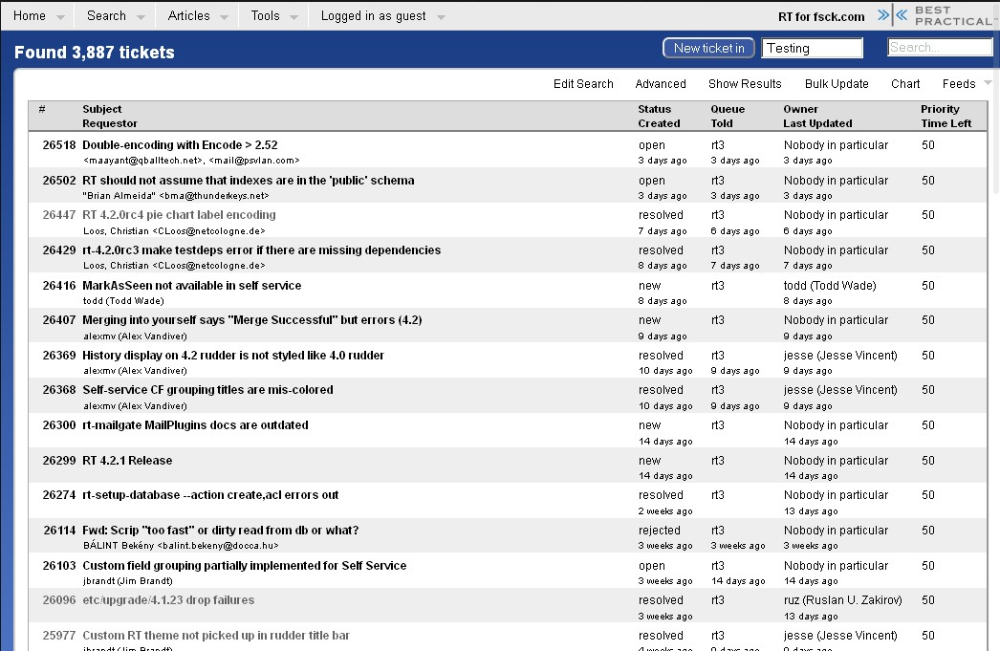

<br/>
<br/>
*"Request Tracker" with thousands of short "asks", zero project context,
no notion of priority, no transparency.*
]

???

Read the slide, click 2 and linger<br/>
Though a large infrastructure, it was static, and shared.  Separation between a
"factory" and a "startup" sharing resources, frequent breakage.

* Scale of data
* Sharing millions of lines of Perl
* Big Oracle databases
* RT with one line ticket requests
* LIMS and labs needed stability and scale
* APIPE and researchers needed rapid change
* <br/>
* Competing drivers and a team slow to move
* My goal was to be the driver of change

First we needed to change how we organized and revealed projects.

Next slide is results, talk about transforming project management.

--
.right-column[
**Task:** Close the gap between the Ops, Dev and Users.
]
--
.right-column-up[
**Action:** Establish relationships and introduce new tools.
]
---
.left-column[
# Scenario

Backstory


]

.right-column[
### Results

* Introduced Atlassian with Agile and Kanban
* JIRA revealed project metrics for the first time


<br/>
<br/>
Specific "wins" began to convince a skeptical team,
initially hostile to new methods and tools.


<br/>
<br/>
<br/>
<br/>
Tools and process spread across all of MGI, 30+ projects/teams.
]

???

* I had Atlassian experience from Trustwave
* Management was open, but didn't know what to do
* The team was *not* open and resisted change
* <br/>
* Becoming friends with developers, meeting scientists/users
* Dev leads were also looking for improvements
* <br/>
* Systems was the isolated group
* <br/>
* We were even *physically* separated, rooms/offices
* Establishing lines of communication, talking things out, revealing problems
* <br/>
* Not being dogmatic
* Not enough people for Scrum roles, no product owners
* eg. Owning your code is a requirement for Agile
* Ops/Systems has lots of investigation time
* Dev *and* support, lots of interruptions for adhoc and fires
* Began showing people that things *can* change

Lessons included meeting people where they are. Understanding their incentives,
why they oppose or support things, and building in success for others.
*Showing* how something could improve their workflow.

Next up is virtualization for velocity.

---
.left-column[
# Scenario

Backstory
]

.right-column[

### Transforming Systems Engineering

**Situation:** Most computing is happening within a compute cluster
build with static OS images. Supporting gear is required in terms
of databases, message queues, caching, load balancers, etc. More
importantly, test environments are needed, but missing.
]

???

Now that we can "see" the projects better, they were too slow.
The pace of innovation was blocked by a fixed set of computing resources.

* Introduce VMware for production infra
* Introduce OpenStack for development infra
* Introduce Vagrant

--
.right-column-up[

**Task:** Provide self-service development environments.

**Action:** Implement virtualization technologies, first with VMWare, then OpenStack.
]
---
.left-column[
# Scenario

Backstory


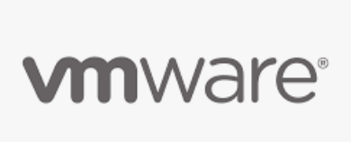
]
.right-column[
### Results

* Velocity increases for both Dev and Ops teams.
* On-demand envs with Vagrant and Openstack.


]

???

Along with virtualization, we began using Git and Puppet for configuration
management and change control. Those topics could be unto themselves, as they
are large. But virtualization impacted multiple teams.

* VMWare was stable enough for production IT loads.
* Openstack was flexible enough for arbitrary development stacks.
* We had hopes for VMs on demand (though never got there).
* <br/>
* APIPE and LIMS dev teams could auto-provision separate dev environments
* Each team could explore tooling

Lessons: "I'll bet you a beer you won't get VMware". I won't that bet
because I could discern what mattered to management, cost vs. flexibility.
The desire of *one* manager (mine) wasn't enough, but when I could show
the *other* managers (APIPE and LIMS) what could be possible, the three
of them together could convince Directorship to spend the money.

Also, define "toil" or repetetive work that doesn't lead to advancement.
The on-call role allowed Devs to advance.

--
.right-column-up[

Virtualization contributed to the acceleration of cultural shifts. Systems team
became similarly equipped to APIPE/LIMS teams. Cloud providers were just
beginning to drive the idea of "Services".

Separate support/on-call from development to maintain focus.

We began to identify and minimize "toil".

]
---
.left-column[
# Scenario

Backstory

<!--
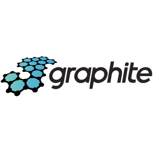
<br/>

-->
]

.right-column[

### Transforming Systems Engineering

**Situation:** Now with stronger relationships with Dev teams and scientists/users, a better
understanding emerges. Devs need to stop needing "'root' hands" to deploy changes
or gather performance data related to benchmarking or performance analysis.
]

???

3 slides, 2 clicks<br/>
This slide is about revealing data to make decisions.

* Grafana and data allowed different teams to "see" better.
* They could alter Dev roadmaps.
* But they were still making packages Ops had to deploy as "root".

--
.right-column-up[
**Task:** Provide data to guide decision making and event response.
]
--
.right-column-up[
**Action:** Deploy Graphite and Grafana to reveal metrics. Train Devs on packaging
to own complex software dependency trees.
]

---
.left-column[
# Scenario

Backstory


]
.right-column[
### Results

* Produce dashboards relative to primary and secondary analysis
* Convince Devs to own software packaging: .deb, .rpm


<br/>
<br/>
*A LIMS dashboard revealing pipeline status.*
<br/>
<br/>
<br/>
<br/>
<br/>
<br/>
<br/>
<br/>
Dashboards revealed data relative to different teams, who were then able to make
independent, educated decisions on changes to make. Once Devs own their own
software dependencies, they own their own velocity.
]

???

Results are about revealing and correcting cross-team changes leading to breakage.

* Up until this point, Devs needed to ask Systems to make software deployment
changes. "Go make a package of X software for me."
* Ops would deploy a change for APIPE, which would break something for LIMS.
* We taught them to own dependencies so we could prevent cross-team breakage.

Lessons: It was easy for everyone to see value in data. It was harder to convince
Devs that they needed to manage their own software dependencies. Just more work
for them. But as some took it on, the failure rates decreased, and it became clearer.
The Devs are the ones "closest to the problem" of "breaking dependencies".

---
.left-column[
# Scenario

Backstory

]

.right-column[
### Transforming Systems Engineering

**Situation:** Infrastructural monoliths and static OS images were the norm.
Leaders were moving to microservices and containers. Our monoliths were too slow
to react to the changing landscape.
]

???

This is the last "scenario". Represents the biggest shift. Devs now actually
deploying directly to production.

First, Second, Third Way<br/>
Biz -> Dev -> Ops -> Customer : 1<br/>
Feedback Loops : 2<br/>
Continuous experimentation/learning : 3<br/>

SRE and DevOps<br/>
The Golden Signals<br/>
Latency, Traffic, Errors, Saturation<br/>
Lead time for changes<br/>
Deployment frequency<br/>
Time to restore service<br/>
Change failure rate<br/>

--
.right-column-up[
**Task:** Break apart the monoliths and introduce portable software runtimes.
]
--
.right-column-up[
**Action:** Introduce Docker. Migrate huge Oracle instance to separate PostgreSQLs.
]
---
.left-column[
# Scenario

Backstory

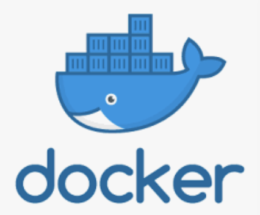

]

.right-column[
### Results

Docker began one of the most significant cultural shifts.

* Break apart monolithic Perl code
* Move software into Docker containers
* Separate complex dependency trees
* Allow teams and tools to evolve at different rates
* Deploy directly to production via CI/CD
* Migrate Oracle to PostgreSQL
* Introduce Ansible
* Solved the "static OS image" problem
* Solved the "docker runs as root" problem
* Solved the "two run" problem of PuppetDB
* Solved "coordination across hosts"
]

???

1 click<br/>
There's a lot to summarize here.

* Containers separated the app from the OS
* Systems, LIMs and APIPE could truly have their own pace
* Scientists also could produce containers, or ask for help to do so
* Software for "the factory" could differ from "bleeding edge"

--
.right-column-up[

We established "loose coupling" where separate primary, secondary analysis
teams could evolve at their own rate. Dockerized all of production. Teach savvy
research staff to build and manage their own containers. Some users used old
tools, some new.

Those with containers could ship them to Cloud offerings for the first time.
]

---

.left-column[
# Scenario

Backstory


]

.right-column[

### The Story So Far

This has been a decade of bringing the state-of-the art, leading a team, and
influencing others:

* Introduce Atlassian Suite
* Introduce Agile/Kanban/DevOps
* Define and manage "toil"
* Introduce CI/CD: Jenkins/Bamboo
* Introduce Git to Ops
* Introduce Puppet and Ansible
* Introduce VMWare, OpenStack, Vagrant
* Introduce Graphite, Grafana
* Introduce Prometheus, PagerDuty
* Introduce ELK, RabbitMQ
* Migrate Oracle to PostgreSQL
* Introduce Docker
* Introduce Cloud (GCP, Azure, AWS)
* Manage industry leading compute
* Manage 15+ PB of storage
* Partner with research teams

*All of the above included countless hours of development, problem solving, debugging, ETL,
data migration, script writing, query analyzing, and technical know-how.*
]

???

The story so far is about the establishment of a modern development and
operations environment. I felt it was important to demonstrate the fact that
I'm not about to simply show you an example project using DevOps methods and
tools, but that those methods didn't exist before I established them.

This represents an enormous amount of "cultural shift" that I feel largely
responsible for leading. Thus I think it's a strong example of "leadership"
both directly and by influence.

The science comes on the next slide.

---
.left-column[
# Scenario
Backstory

]

.right-column[
### All In Service Of Science

* Genome Reference Consortium (GRC)
* Human Microbiome Project (HMP)
* The Cancer Genome Atlas (TCGA)
* 20,000 genomes, 33 cancer types
* Pediatric Cancer Genome Project (PCGP)
* 2,000 patients St. Jude
* Trans-Omics for Precision Medicine (TOPMed)
* 90,000 genomes
* Centers for Common Disease Genomics (CCDG)
* 60,000 genomes

]

???

Don't go too fast here.

My story has focused on the evolution of an organization from an
"Operations"-centric viewpoint. I may have been better served
talking about working directly with scientists.

* Chip and Kristin and BLAST jobs
* Todd and Snakemake workflows
* APIPE and Workflow management
* APIPE and LIMS and SQL optimization
* Writing perl and python and ruby
* Debugging applications and filesystems

But while I did do all of those things, the goal of these introductory stories
is to talk about "leadership" and "influence" at a higher level, which I
believe has had a broader impact.

Nevertheleess, it was not about "tools" for their own sake, but how those
tools and processes made the whole organization more effective.

Coming up will be stories about what my role is on a daily basis.

--
.right-column-up[
... and many more.

This story is about the creation of a modern data science infrastructure, and
leading a community of users to the use of supporting portable, containerized,
repeatable science, ready for Hybrid Clouds.

*Exercise for the audience: Why not just skip on-prem and go directly to cloud?*
]

---
.left-column[
# Scenario
Backstory

]

.right-column[
### What's Matt's Role?
Issue creation, *defining* work:

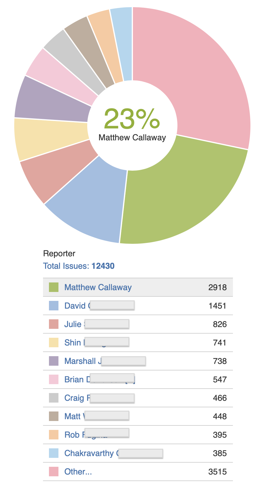
]

???

This series of slides is intended to give you a sense of what my role is.
Am I all high level? Am I just following orders? How much of what is being
shown is really mine?

* You'll see I create most of the JIRA issues.

---
.left-column[
# Scenario
Backstory
]

.right-column[
### What's Matt's Role?
Issue assignment, *leading* work:

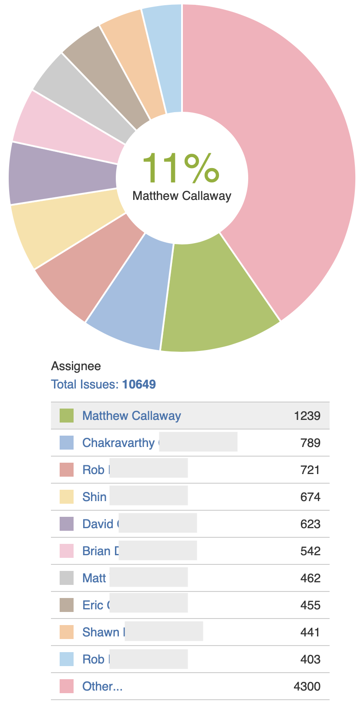
]

???

* You'll see I'm assigned most of the JIRA issues.

---
.left-column[
# Scenario
Backstory

Total Lines:

- Ansible: 159,761
- Puppet3: 86,143
- Puppet4: 68,543
- Docs: 40,562
- Manual: 8,477
]
.right-column[
### What's Matt's Role?
Git commits, *doing* work:


]
???
* You'll see I'm a major git committer.
* This is for Ansible, Puppet 3/4
* As well as all documentation

---
.left-column[
# Scenario
Backstory
]
.right-column[
### What's Matt's Role?
Pull requests, *sharing* work:


]
???
* You'll see I'm a major PR reviewer.
---
.left-column[
# Scenario
Backstory
]

.right-column[
### What's Matt's Role?
Project management, *managing* work:

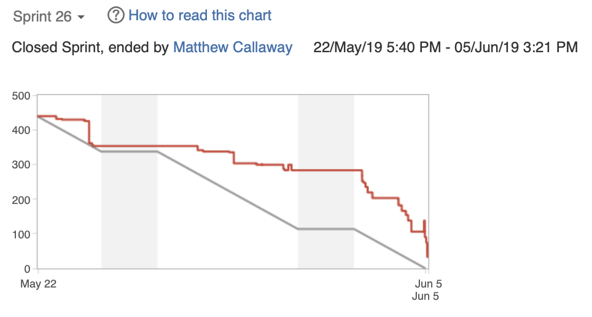

* Inspired by Agile
* Inclusive of Kanban for Support
* "on-call" rotation to protect Development

Communicating to management, users, team members, and related stakeholders.
]

???

* Note that I ended the sprint here.
* I also created the sprint.

In short, I am not "simply a manager".

* I'm a manager
* I'm a developer
* I'm a sysadmin
* I'm a QA engineer
* I'm a user support tech
* I'm a technical writer
* I'm a jack of all trades

Now let's talk technical with an example.

---
.left-column[
# Scenario

Problem Statement
]

.right-column[

### A Technical Deep Dive

In 2017, Washington University in St. Louis moved the McDonnell Genome
Institute (MGI) IT Team to a central IT group, forming Research Infrastructure
Services (RIS).
]

???

I've now demonstrated my role in the creation of a modern data science platform
at MGI. By 2015-2016, things were changing, Directors had moved on, MGI
leadership was adrift. Wash U stepped in.

We, as MGI IT, had developed an infrastructure that was both
a "factory" (stable/careful) but also an engine of "exploration" (lots of change).
Many leaders in genomics and cancer research had found success. Now we need
to generalize this and create a "service" university wide.

* We are no longer McDonnell Genome Institute IT.
* We are Wash U IT Research Infrastructure Services.

--

.right-column-up[
**Mandate:**

**Create a University-wide Service Catalog providing "research infrastructure" to
faculty, staff, and students.**

]
--
.right-column-up[
* Define the stakeholders involved
* Define the lifecycle of the data involved
* Define the accesss rules
* Define the network paths
* Define storage and computing resources
]
---
.left-column[
# Scenario

Build Compute and Storage
]

.right-column[

### The Stakeholders

* U Leadership: Political pressures
* U Governance: Competing priorities
* U Researchers: Needing resources
* PIs: Feeling financial strain
* RIS Team: Not yet well integrated into WUIT
]

???

It's important to note here that the scope of stakeholders is much wider.

* MGI was a single department with many Investigators.
* Now we're talking about the entire University, every school, every department, all of their researchers.

The starting state is separate fiefdoms that do not want centralized
services... yet they cannot afford to build them themselves.

The subsequent slides you can walk through pretty quickly I think.

--
.right-column[

#### The starting state...

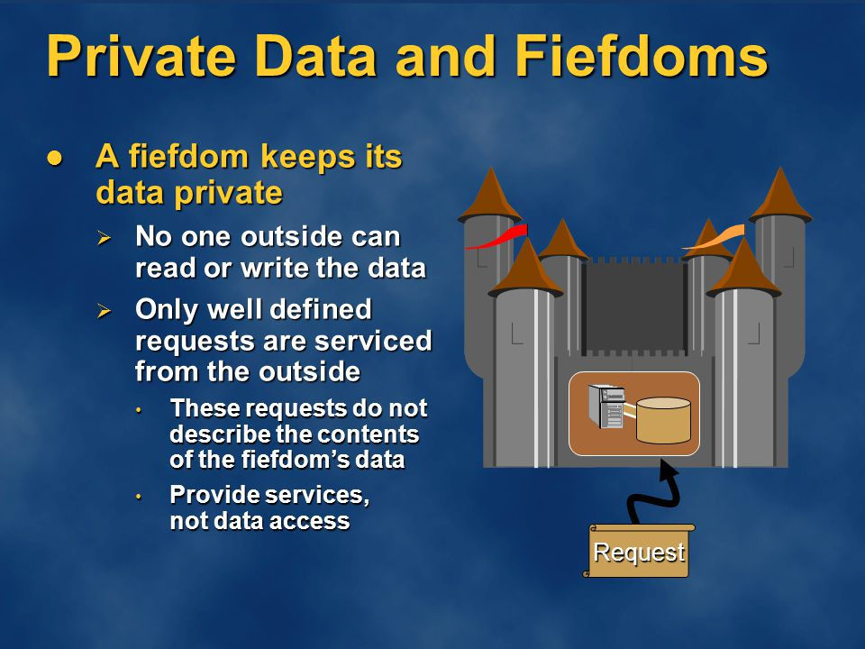
]
---

.left-column[
# Scenario

Build Compute and Storage
]

.right-column[
### The Team

* 1 Director
* 1 Architect
* 4 Team Leads (including me)
* User Support (2)
* Hardware Engineering (3)
* Application Engineering (6)
* Systems Engineering (6) (**my team**)


]
---
.left-column[
# Scenario

Build Compute and Storage
]

.right-column[
### Establishing Relationships

* Wash U senior leadership
* Other Wash U Technical Teams
* Principle Investigators
* Technically Savvy Researchers and Staff
* Users, Vendors, Collaborators, ...more


]

???

Note here that I've made myself the "communicator".

* I "only" lead SysEng, but these are *my* relationships
* The other leads do not do this

---
.left-column[
# Scenario

Build Compute and Storage
]

.right-column[

### Analyzing Risks

* Integrate Networks
* Integrate Identity
* Establish Governance
* Establish Funding/Chargeback
* Competition from other groups
* Move from Ubuntu to RHEL
* Incorporate SELinux
* Incorporate Docker
* New major versions of IBM software

#### Much of the tech is familiar, but lots of change.

#### Also, politics.


]
---
.left-column[
# Scenario

Build Compute and Storage
]

.right-column[
### Leverage Established Methodologies

The early part of This Story demonstrated the **establishment**  of
DevOps tools and methodology. Now we leverage these to build new
services.


]
---
.left-column[
# Scenario

Build Compute and Storage
]
.right-column[
### Storage Design
Storage services allow Users to access high performance
storage using SMB, Globus, or POSIX interfaces. Produce
Ansible representations to build and manage all aspects:


]
---
.left-column[
# Scenario

Build Compute and Storage
]
.right-column[
### Compute Design
Compute services allow Users access to a job scheduler.
Execution nodes connect to scratch and cache storage.
Produce Ansible representations to build and manage all aspects:

]
---
.left-column[
# Scenario

Build Compute and Storage
]
.right-column[
### Storage Design

Ansible Inventory Groups

```shell
@storage_gpfs_storage1:
  |--@storage_gpfs_storage1_ces:
  |  |--rdcw-5-12-ces1.ris.wustl.edu
  |  |--rdcw-5-12-ces2.ris.wustl.edu
  |  |--rdcw-5-12-ces3.ris.wustl.edu
  |--@storage_gpfs_storage1_dtn:
  |  |--rdcw-5-12-dtn1.ris.wustl.edu
  |  |--rdcw-5-12-dtn2.ris.wustl.edu
  |--@storage_gpfs_storage1_fsmgr:
  |  |--storage1-fsmgr1.ris.wustl.edu
  |--@storage_gpfs_storage1_gui:
  |  |--storage1-gui1.ris.wustl.edu
  |--@storage_gpfs_storage1_hsm:
  |  |--rdcw-5-12-hsm1.ris.wustl.edu
  |  |--rdcw-5-12-hsm2.ris.wustl.edu
  |--@storage_gpfs_storage1_ilm:
  |  |--storage1-ilm1.ris.wustl.edu
  |--@storage_gpfs_storage1_nsd:
  |  |--rdcw-5-12-nsd1.ris.wustl.edu
  |  |--rdcw-5-12-nsd2.ris.wustl.edu
  |  |--rdcw-5-12-nsd3.ris.wustl.edu
  |--@storage_gpfs_storage1_tsm:
  |  |--rdcw-5-12-tsm1.ris.wustl.edu
  |  |--rdcw-5-12-tsm2.ris.wustl.edu
```
]
---
.left-column[
# Scenario

Build Compute and Storage
]
.right-column[
### Storage Design

Ansible Roles and Playbooks

```bash
- role: accounts-domain-member
- role: ahuffman.resolv
- role: ris.collectd
- role: ris.common-packages
- role: ris.logrotate
- role: ris.ntp
- role: ris.prometheus-exporters
- role: ris.register-rhn
- role: ris.rsyslog
- import_playbook: cluster_facts.yml
- import_playbook: fileset_quota.yml
- import_playbook: gpfs_callbacks.yml
- import_playbook: gpfs_ces_enable.yml
- import_playbook: gpfs_ces_server.yml
- import_playbook: gpfs_filesets.yml
- import_playbook: gpfs_gui_enable.yml
- import_playbook: gpfs_mounts.yml
- import_playbook: gpfs_servers_setup.yml
- import_playbook: gpfs_setup_afm.yml
- import_playbook: gpfs_ssh_prereqs.yml
- import_playbook: interface_options.yml
```

```bash
> git ls-files -z services/storage/ | xargs -0 wc -l
   44739 total
```
]
---
.left-column[
# Scenario

Development
]
.right-column[
### Development in Git/BitBucket

Ansible development represents "Infrastructure as Code", where
we implement a model representing complex interconnected systems
and their interfaces. Development happens in "git" with a standard
branching model:


]

---
.left-column[
# Scenario

Testing
]
.right-column[
### Unit Testing in Bamboo

Feature and master branches are tested in Bamboo with linters,
syntax validation, and requirements testing. This is true with
both Ansible and Puppet:

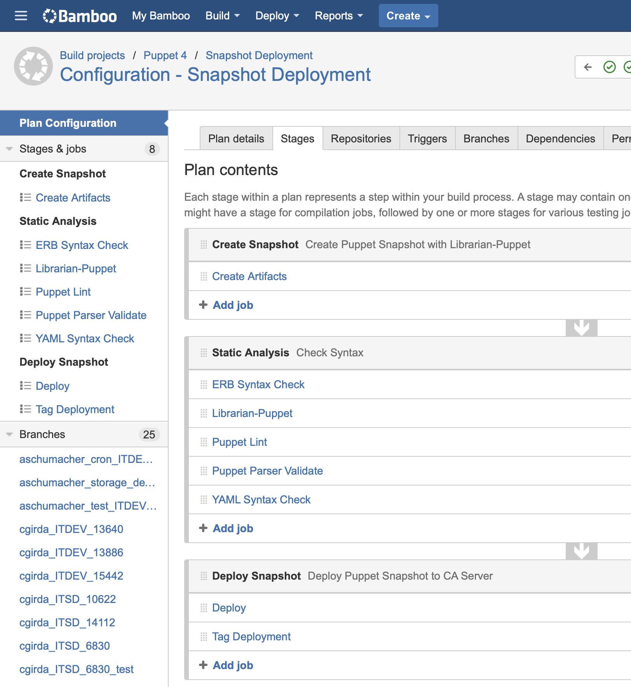
]
---
.left-column[
# Scenario

Testing
]
.right-column[
### Integration and Acceptance Testing in Jenkins

Bamboo's integration with other Atlassian tools led us to use
it "close to the code", but our use of Jenkins for other "scheduled jobs"
and the operation of LIMSes led us to use it for integration
and acceptance testing:


]
---
.left-column[
# Scenario

Testing
]
.right-column[
### Integration and Acceptance Testing in Jenkins

Scheduled jobs with Jenkins is also how we gather metrics from
production environments:


Note that all Jenkins and Bamboo jobs are themselves managed with Git,
and go through peer review Pull Requests.
]
---
.left-column[
# Scenario

Metrics
]
.right-column[
### Data Vizualization

Metrics related to the infrastructure are gathered both via scheduled
checks, feeding Graphite and Grafana:


]
---
.left-column[
# Scenario

Metrics
]
.right-column[
### Data Vizualization

Metrics are also gathered via Prometheus and "data exporters" on various
subsystems:


]
---
.left-column[
# Results

User Experience
]
.right-column[
### What Does It Look Like?

The SMB interfaces is as one would expect:


]
---
.left-column[
# Results

User Experience
]
.right-column[
### What Does It Look Like?

The Globus interfaces offers easy file transfer into storage:

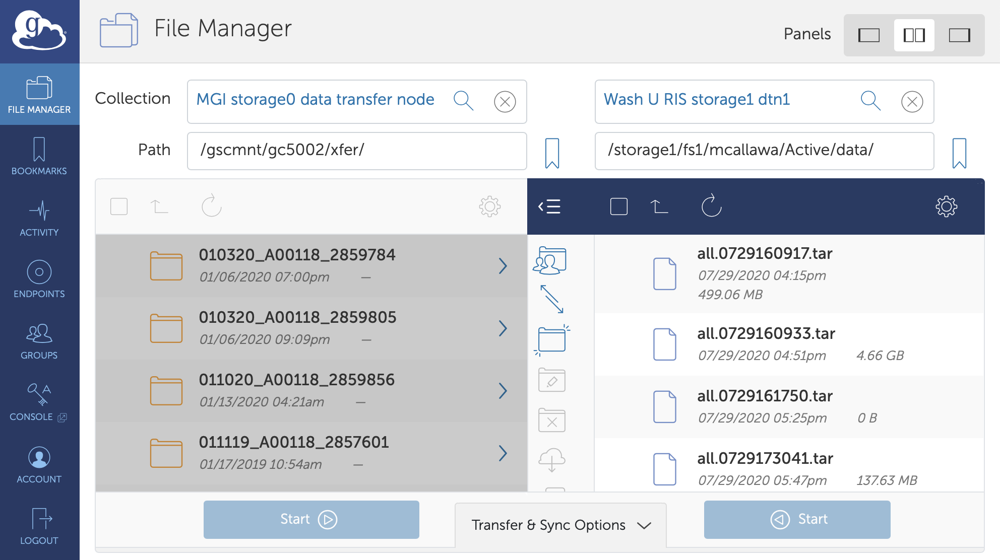
]
---
.left-column[
# Results

User Experience
]
.right-column[
### What Does It Look Like?

With data uploaded via SMB or Globus, a standard POSIX interface:
```terminal
[mcallawa@compute1-client-1 ~]$ whoami
mcallawa
[mcallawa@compute1-client-1 ~]$ hostname
compute1-client-1.ris.wustl.edu
[mcallawa@compute1-client-1 ~]$ ls -l /scratch1/fs1/mcallawa
total 34
drwx--S---. 2 mcallawa compute-mcallawa 1024 Oct 23 15:41 data
[mcallawa@compute1-client-1 ~]$ ls -l /storage1/fs1/mcallawa
total 33
drwx------. 11 root root          8192 Oct 24 18:54 Active
drwx------.  2 root ris-it-admin  8192 Jul 23 16:19 Archive
-rw-r--r--.  1 root root          2327 Sep 17 11:30 README.txt
```
]
---
.left-column[
# Results

User Experience
]
.right-column[
### What Does It Look Like?

The job scheduler offers a host of features:


```terminal
$ bqueues general-interactive
QUEUE_NAME      PRIO STATUS      MAX NJOBS PEND RUN SUSP
general-interac  10  Open:Active   -   154    0 154    0
```
]
---
.left-column[
# Results

User Experience
]
.right-column[
### What Does It Look Like?

* Launching programs can be as simple as ``/usr/bin/python`` or as complex as a full Desktop with VNC:

```json
[mcallawa@compute1-client-1 ~]$ compute1-gui-desktop
...
Created password for your noVNC web login.
Your password for noVNC is: 3gGVEkrWd6I=
...
You can access your compute1 desktop with th url
https://compute1-exec-142.compute.ris.wustl.edu:8901/vnc.html?resize=remote
```


]
---
.left-column[
# Results

Summary
]
.right-column[
### Working With Users

An excerpt of a quote from an early user:

.box[
We have piloted our approach on 20,000 individuals. In this pilot, our method
uncovered at least a dozen genetic associations with height and basal
metabolic rate that standard methods did not... We aim to scale our method
... in cohorts with over 100,000 individuals.

Acknowledgements:

We'd like to thank Matt Callaway and the rest of the RIS team for their help
in getting early compute1 access and support which has been absolutely
necessary for our progress on this project.
]

#### We've built a platform for *discovery* helping researchers advance their science.
]
---
.left-column[
# Results
Metrics
]
.right-column[
### Summary of FY2020

Numbers representing one year for RIS: support, application and systems
development, and hardware engineering teams:

* 31,000 files to dbGaP, SRA (TOPMed)
* 15,926 genomes (262 TB) to Cloud (CCDG)
* 2,724 service desk requests: Rating: 4.9/5
* Average response time: 3.98 hours
* SLA met: 76% of the time
* 2,734 development issues
* 20 projects over 320 git repos
* 5,000 commits: 4 million adds, 2 million removed
* 1,000 Pull Requests merged
* 917 total allocations by PI, grow storage by 40%
* Grow the User community from 1,483 to 1,906 users
* Add 3PB dism+tape for general consumption
* Add 2PB disk+tape for "condos"
]
---
.left-column[
## Conclusions

]

.right-column[
### I hope to have demonstrated

* Leading projects both directly and by influence

  - Transforming not only my own team but entire organizations

* Development methods (infrastructure as code)

  - Establishing DevOps from nothing
  - Completing a cultural shift
  - Building complex data systems

* Driving business decisions

  - Transforming IT at MGI
  - Setting the standard for Wash U
  - Being asked by Wash U to grow
  - Enabling many researchers
]

???

* Here I am at my conclusion. I hope that I have demonstrated
that I am curious, tenacious, and empathetic.
* That I have spent my career learning and mastering complex and technical environments.
* That I have enabled scientists to push the frontiers of knowledge.
* That I have worked effectively leading and participating in organizations.
* That not only to I *use* modern best-practices in developing computing environments,
but that I've *built* and *established* them from scratch.

Now it is time to consider what comes next.

---
.left-column[
# The Future

]
.right-column[
### Data Engineering

So what's next? How does "Senior Data Engineer at Bayer" fit into Matt's career goals?


]

???

Notes on the next slide...
Don't talk about the hierarchy of needs until you advance 1 click.

---
.left-column[
# The Future

]
.right-column[
### Data Engineering

So what's next? How does "Senior Data Engineer at Bayer" fit into Matt's career goals?


]

???

* Recall I started out in an "Ops" role
* I started out "close" to the science at MGI
* But 2017 pivoted and now I'm a general service provider
* I want to get back closer to the science
* I want less "management" and more "technical"
* <br/>
* DevOps is now "ML Ops"
* Apply the methods to models and data
* Cloud has largely solved IT issues
* The state of the art is AWS et.al.

I'm looking to stop reinventing wheels and climb the hierarchy

---
.left-column[
# Q & A
]
.right-column[

### Discussion

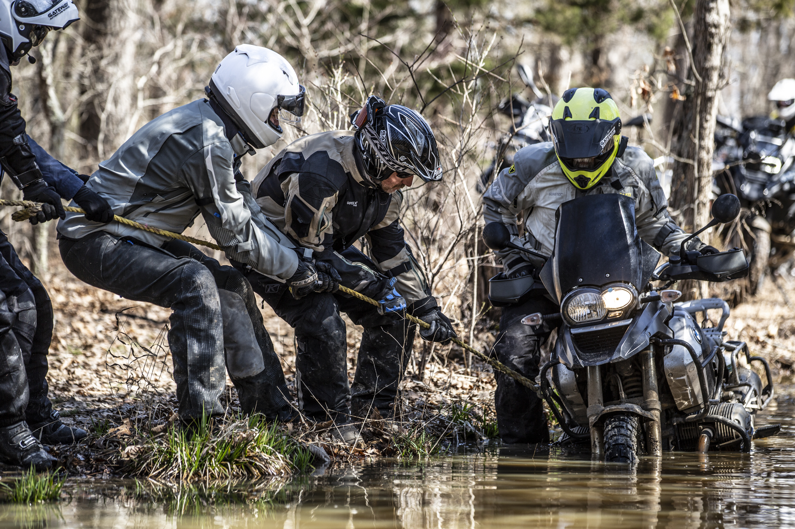

*Even high performance machines sometimes get stuck in the mud.*

# Thank you!
]

<!--
background-image: url(./images/agile.png)
background-position: right 200px bottom 10px
-->
