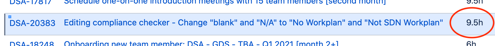
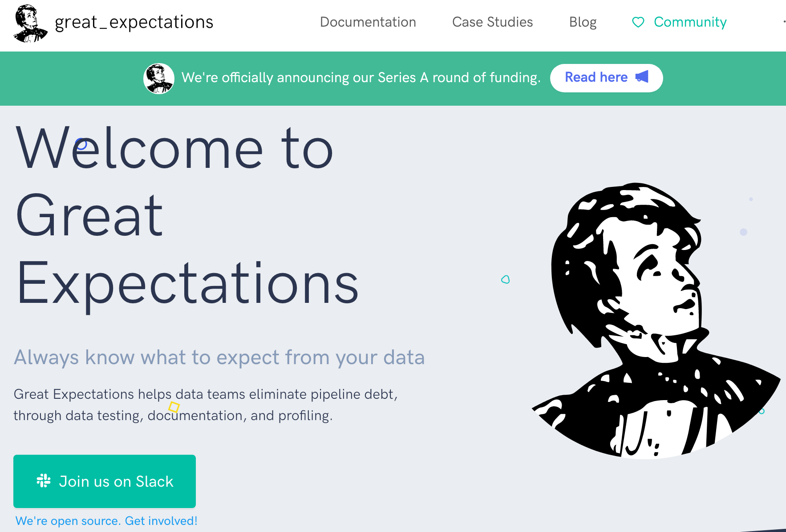
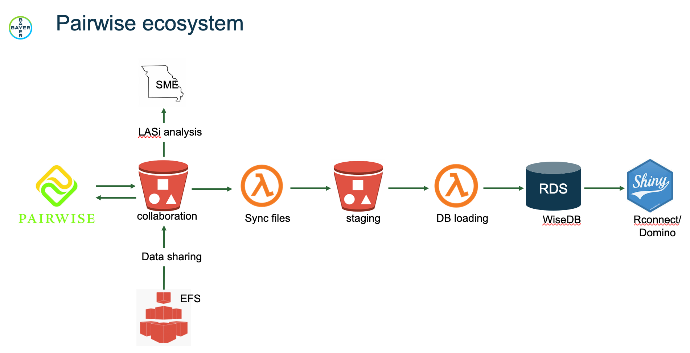
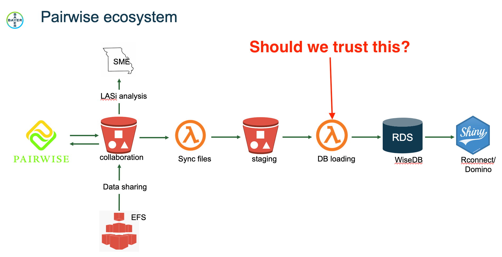
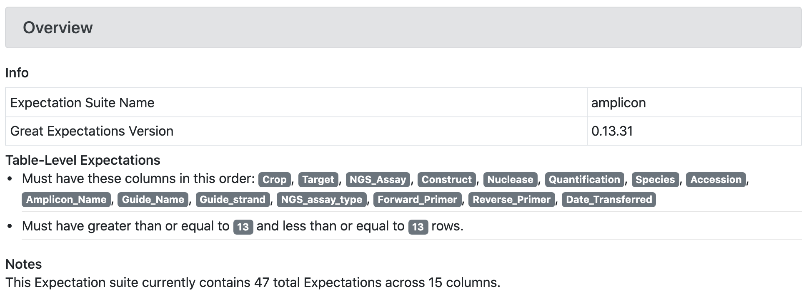
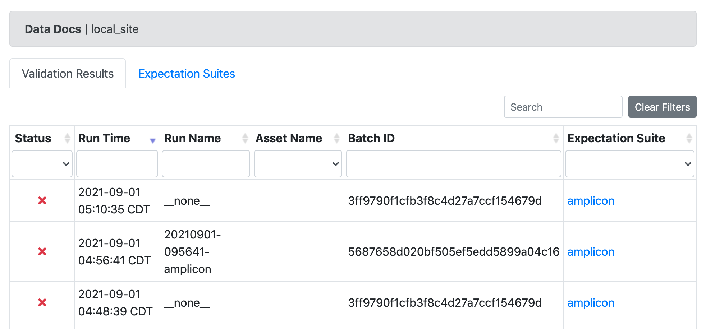

layout: false
class: center, middle, inverse

## Data Quality and *Great Expectations*

### August 2021

---

.left-column[
## Agenda


]

.right-column[
### Data Quality Control with *Great Expectations*

* Flavors of the Data Quality Problem.
* How does *Great Expectations* help?

*Goals for this conversation...*

* Recognize data quality risk exposure.
* Recognize data QC steps are desirable.
* Recognize that communication is key.
* Specific focus on external collaborations.

*GE* is as much about *communication* as *technology*.
]

---
.left-column[
## Defining The Problem
Data Quality
]

.right-column[
## What is the problem?

### Claim:

#### *“When users notice data issues before data owners, trust in the data erodes!”*
]

---
.left-column[
## Defining The Problem

Data Quality
]

.right-column[
## “When users notice data issues before data owners, trust in the data erodes!”

Example: Pairwise DB column typo

```shell
SELECT * FROM TABLE
SELECT *
 FROM information_schema.columns
WHERE table_schema = 'wisedb'
  AND table_name   = 'amplicon';
```
]
--
.right-column-up[
Compare the `amplicon` table with the other 14 tables:

```shell
CREATE TABLE wisedb.amplicon (
    id integer NOT NULL,
    ...
    date_transfered text, # <-- Typo and wrong type
    ...
);
```

```shell
CREATE TABLE wisedb.copy_number (
    id integer NOT NULL,
    ...
    date_transferred character varying,
    ...
);
```
]

---
.left-column[
## Defining The Problem

Data Quality
]

.right-column[
## Heard in the last 6 months

#### "Add code to work around misspelled `date_transfered`."
]
--
.right-column-up[

#### "It took 2 weeks to find that `PMON` vs. `pMON` was the issue."
#### "Let's meet to discuss what the data should look like."
#### "Let's meet to find out where that failure is."
#### "Forecasting is already difficult, data problems make it even worse."

]


---
.left-column[
## Defining The Problem

Data Quality
]

.right-column[
## Spreadsheet Risk

Use of Excel yielding corrupted data is widespread.

### Genome Biology, August 2016
]
.right-column[

### Gene name errors are widespread in the scientific literature

https://genomebiology.biomedcentral.com/articles/10.1186/s13059-016-1044-7
]
--
.right-column-up[
*The spreadsheet software Microsoft Excel, when used with default settings, is
known to convert gene names to dates and floating-point numbers. A programmatic
scan of leading genomics journals reveals that **approximately one-fifth of
papers with supplementary Excel gene lists contain erroneous gene name
conversions**.*
]
---
.left-column[
## Defining The Problem

Data Quality
]
.right-column[
## Spreadsheet Risk

### PLOS computational Biology, **July 30, 2021**

### Gene name errors: Lessons not learned

https://journals.plos.org/ploscompbiol/article?id=10.1371/journal.pcbi.1008984
]
--
.right-column-up[
We hypothesized that such errors in supplementary files might diminish after a report in 2016 highlighting the extent of the problem. To assess this, we performed a scan of supplementary files published in PubMed Central **from 2014 to 2020**. Overall, gene name errors **continued to accumulate unabated in the period after 2016**. An improved scanning software we developed identified gene name errors in **30.9% (3,436/11,117) of articles** with supplementary Excel gene lists; a figure significantly higher than previously estimated. This is due to gene names being converted not just to dates and floating-point numbers, but also to internal date format (five-digit numbers). **These findings further reinforce that spreadsheets are ill-suited to use with large genomic data.**
]

---
.left-column[
## Defining The Problem

Data Quality
]
.right-column[
## What then is the cost of "data issues"?

]
--
.right-column[
### The easiest answer is *loss of time*.

It takes time to find and resolve application issues related to data.



### The more important answer is loss of *trust*

Our tools guide human decision making.

## Our humans need to trust their data

]
---
.left-column[
## Tools and Solutions

Data Quality
]
.right-column[
## Addressing data quality problems

So what can we do to improve data QC?

]
--
.right-column-up[
I'm about to start talking about **tools.**

- **Great Expectations** (Python)
- Data Validator (R)
- JSONSchema (Python)
- pydqc (Python)
- ... more ...

But tools without process aren't enough.

### More important is communication

Is there a tool that can help QC that includes a communication component?
]

---
.left-column[
## Tools

Data Quality
]
.right-column[
## Introducing Great Expectations

What is *Great Expectations*, and how does it apply to this problem?


]
---
.left-column[
## Tools

Data Quality
]
.right-column[
## Great Expectations (GE)

Key Features

- Expectations (assertions about data)
- Data profiling (start with existing data)
- Data validation
- **Data documentation** (*important*)

]
--
.right-column-up[
What does GE *NOT* do?

- GE is NOT a pipeline execution framework (Airflow, Dagster)
- GE is NOT a data versioning tool (Quilt)
]
--
.right-column[
### GE would be *integrated into workflows as QC steps*
]

---
.left-column[
## An Example

The Pairwise

Collaboration
]
.right-column[
## The Pairwise Collaboration

Consider data coming from our collaborators, eg. Pairwise, BLI, etc.


]

---
.left-column[
## An Example

The Pairwise

Collaboration
]
.right-column[
## The Pairwise Collaboration

- External staff drop file into S3
- S3 Event triggers Lambda
- Lambda loads RDS (no data QC)


]
--
.right-column-up[
### Goal: Validate incoming data from Pairwise?

...*before* we load it into our RDS database!

]

---
.left-column[
## An Example

Adding QC
]
.right-column[
## Adding validation with *expectations*

See the [Glossary of Expectations](https://docs.greatexpectations.io/docs/reference/glossary_of_expectations/)

Start is with a set of "known good" data.

```shell
great_expectations init
great_expectations datasource new
great_expectations suite new BLI_load --profile
great_expectations checkpoint new BLI_checkpoint
```

These open [Jupyter Notebooks](http://localhost:8888/tree)

*(See GE Notebooks)*
]

---
.left-column[
## An Example

Adding QC
]
.right-column[
## Adding validation with *expectations*

Now we have a starter set of expectations with which we can test new data,
as well as **data definition documentation**.

Expectations JSON:

```shell
> head -n 6 great_expectations/expectations/BLI_load.json 
{
  "data_asset_type": null,
  "expectation_suite_name": "BLI_load",
  "expectations": [
    {
      "expectation_type": "expect_table_columns_to_match_ordered_list",
...
```

[//]: # (comment for closing bracket: ] )

### Goal: Ship data expectations together with pipelines.
]

---
.left-column[
## An Example

Adding QC
]
.right-column[
## Adding validation with *expectations*

Now that we have our expectations, let's examine **bad data**.

]
--
.right-column-up[
Create make `BLI_data_file_load_example_bad.csv` with some "bad" values.

- Bad Device `E73149`, starts with `E`
- Bad Time_Stamp `2021 16:15`, missing day/month
- Null `CountAlgorithmName`
- Null `View`

]
.right-column-up[

### **Validate** the file using a GE **Checkpoint**

Then see the resulting *documentation*.

### Goal: Share data documentation with all human stakeholders.

*(See GE Checkpoint Notebook)*
]

---

.left-column[
## An Example

Adding QC


]
.right-column[
## Adding QC to the existing AWS Lambda

- We develop *data expectations*
- We add QC steps that *validate* data using *checkpoints*
- Failure generates *notifications*, eg. AWS SNS

]
--
.right-column-up[
An existing AWS S3 Lambda:
]
.right-column-up[
```shell
@@ -101,6 +103,17 @@ def db_update(event):
             tmp_file, usecols=columns, skip_blank_lines=True, names=columns, header=0
         )

+        # This is the data expectations suite
+        with open(f"suite.json") as fd:
+            suite = json.load(fd)
+
+        df = ge.dataset.PandasDataset(
+           data,
+           expectation_suite=suite
+        )
+        result = df.validate()
+
+        if not result.success:
+            notify(
+               message="Data validation failed"
+            )
+            return False
+
         logger.info("Saving data to {os.getenv('dbname')}:%s", table)
         logger.info(data.head())
```
]
---
.left-column[
## An Example

Adding QC


]
.right-column[

## Checkpoint Data Documentation

Documentation as the starting point for conversations about data.


]

---

.left-column[
## An Example

Adding QC


]
.right-column[

## Data Documentation

Documentation as output of QC validation runs.


]

---
.left-column[
## An Example

Adding QC


]
.right-column[

## For Further Exploration...

- Generate *expectations* from JSONSchema
- Streaming GE *batches* with `streamz`
- Deploy data docs re: AWS S3 and CloudFront (already working)
- Integrating GE with data unit tests
- Integrating GE with CI/CD processes
- Integrating GE data definitions with collaborators, early
]

---

layout: false
class: center, middle

# Thank You!

