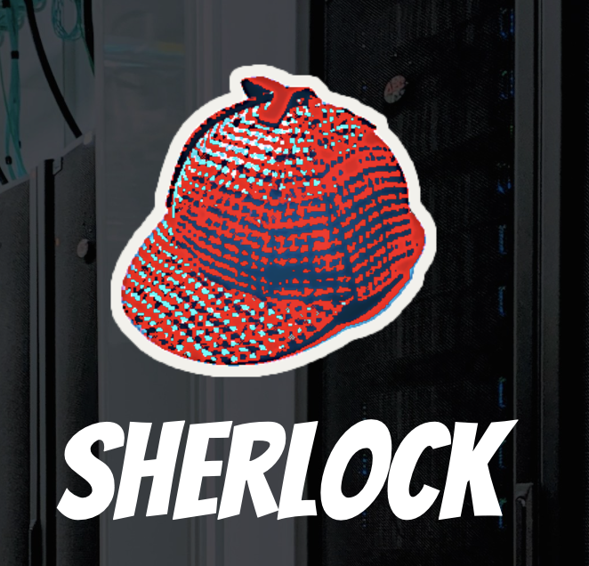
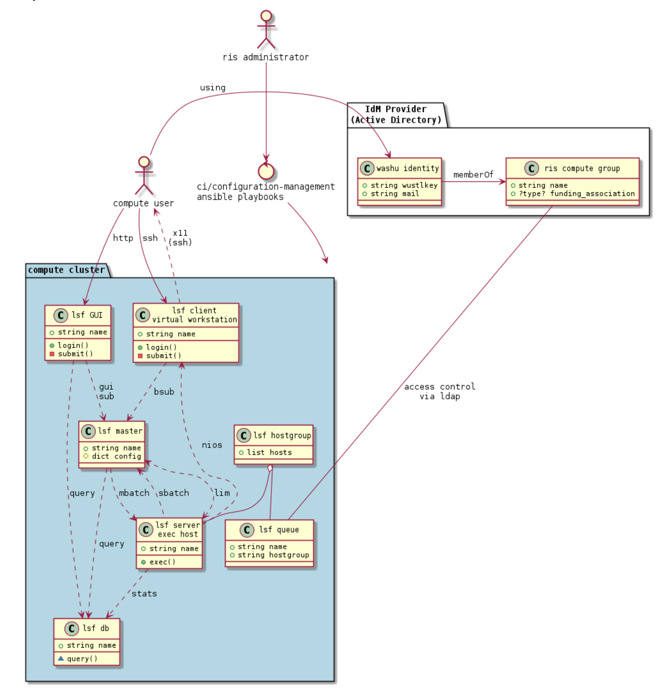

layout: false
class: center, middle, inverse

# AWS SA Work Sample

### An introduction to Matt Callaway
### November 2020

---

.left-column[
# Agenda
]

.right-column[
* ### History (5min)
* ### Backstory (10m)
* ### Technical Scenario, Tools and Methods (20min)
* ### Lessons Learned (5min)
* ### What could have been done with AWS (5min)
* ### Discussion
]
--
.right-column[
### Goals:
* Give a sense of who I am
* What I'm like: employee, coworker, friend
* What I've done: technical, non-technical
* How I work
]

---

.left-column[
# History
About me
]

.right-column[


* 1997: BS. Math, Physics
* 1999: MS. Physics
* 2000-2008: SecurePipe Inc "startup life"


* 2008-2010: SecurePipe acquired by Trustwave
* 2010-2017: McDonnell Genome Institute
* 2017-2020: Wash U RIS


**Outside of work**

* Father of 3
* Linux enthusiast
* CrossFitter
* Bicyclist
* Motorcyclist

"Movement through nature"
]

---

.left-column[
# History

About me

<!--

-->

]

.right-column[

### What's Matt like?

In terms of a maxim or motto...

* Curiosity, tenacity, empathy, in search of balance.
]
--
.right-column[
* Curiosity to seek the truth
* Tenacity to figure it out
* Empathy to care about the affect on others
* Seeking balance (always elusive)
]
--
.right-column[
* "The long tail"
* "Enabler of others"
* "Give me the ball"
* Don't re-invent wheels
* Make a contribution, to the team, to humanity
]


???

* Characteristics that show up in everything I do.
* Curiosity about all things
* The truth matters, there *is* a reality aside from feelings
* Wanting a seat at the table
* What gets me up in the morning

---

.left-column[
# Scenario

Backstory
]

.right-column[

## Begin work at MGI in 2010

* Traditional HPC with static compute images
* Large Oracle OLAP/OLTP databases (billions of rows)
* Laboratory automation (LIMS)
* Basic automated primary and secondary analysis
* Two teams, 15-20 application developers, Perl
]


--

.right-column[
* **Systems team (~5), support and development, basic ticket tracking**
* **Manual changes, no change control, no project management, ad-hoc/reactionary**
]

---

<!--
background-image: url(./images/agile.png)
background-position: right 200px bottom 10px
-->

.left-column[
# Scenario

Backstory
]

.right-column[

## Transforming "Systems" to "Systems Engineering"

* Introduce VMWare: **change velocity**
* Introduce Agile and Kanban: **project visibility**
* Convince a skeptical team

#### Build social/political capital


]

???

* This isn't the way we do things

---

.left-column[
# Scenario

Backstory
]

.right-column[

## Transforming to "Systems Engineering"

Close the devide between "Systems" and "Development" and "Users".

#### Communicating is the key, and better tools help

* Begin to reveal and measure "toil"
* Introduce transparency
* Introduce Git and Puppet: **configuration management**
* Introduce CI/CD
* Introduce "rollback"
* Introduce "blameless post-mortems"


<br/>
<br/>

]

---

.left-column[
# Scenario

Backstory


]

.right-column[

## Transforming to "Systems Engineering"

* The Phoenix Project
* Googe's SRE Book
]
--
.right-column[
* Accelerate cultural shift
* Accelerate velocity
]
--
.right-column[
* Introduce Vagrant and OpenStack
* Introduce tracking software dependencies
* Introduce software packaging artifacts: (.deb, .rpm)

Development teams and their Users began to see a reduction in "break/fix" work.
Change begins to happen without fear. Time to deployment reduces\*.

\* Though we failed to measure MTTR, MTTR, etc

]

---
.left-column[
# Scenario

Backstory


]

.right-column[

## Transforming to "Systems Engineering"

* Introduce Docker
* Solve the "static OS image" problem
* Solve the "docker runs as root" problem
]

--
.right-column[
* Begin transferring "ownership" to PI Labs
* First PI labs move to AWS
* Web sites and databaes (CiViC, DGIdb)
* https://civicdb.org/
* https://www.dgidb.org/
]

--
.right-column[
* Introduce Ansible
* Solve the "two run" problem of PuppetDB
* Improve coordinated action across many hosts
* Development environments in GCP
]

---

.left-column[
# Scenario

Backstory
]

.right-column[

### My story so far

I took a "first among equals" leadership role:

* Creating the Systems Engineering role
* *Living* DevOps as that term came into vogue
* Project Management **without dogma**
* Virtualization technologies: VMware, OpenStack
* CI/CD with Jenkins, Bamboo
* Automation/Change: Git, Puppet, Ansible
* Observability: Prometheus, Grafana
* Centralized Logging: ElasticSearch, Logstash
* Abstraction into a *Service Catalog*
* Leader in the adoption of Docker in HPC

Portable, repeatable science in Hybrid Clouds.

Establishing *ownership* with each Lab.
]

---
.left-column[
# Scenario
Backstory
]

.right-column[
#### What's Matt's role?
Issue creation, *defining* the work

]
---
.left-column[
# Scenario
Backstory
]

.right-column[
#### What's Matt's role?
Issue assignment, *doing* the work

]
---
.left-column[
# Scenario
Backstory
]

.right-column[
#### What's Matt's role?
Git commits, *doing* the work

]
---
.left-column[
# Scenario
Backstory
]

.right-column[
#### What's Matt's role?
Git commits, *doing* the work

]
---
.left-column[
# Scenario
Backstory


]
.right-column[

# Summary

### What's my role?

* See the community and best practices
* See my Org's Mission
* See the required cultural changes
]

--
.right-column[
* Align my team with partners
* Define and own the work
* Bring the tools
* Communicate
* Deliver solutions

### Living each day in the trenches with my team.
]

---
.left-column[
# Scenario

Problem Statement
]

.right-column[

### Let's go deeper

In 2017, Washington University in St. Louis moved the McDonnell Genome
Institute (MGI) IT Team to a central IT group, forming Research Infrastructure
Services (RIS).
]

--

.right-column[
Mandate:

**Create a University-wide Service Catalog providing "research infrastructure" to
faculty, staff, and students.**

* High performance computing
* High performance storage
* Data transfer
]

--

.right-column[
#### Let us focus on the RIS Compute Service.
]

---
.left-column[
# Scenario

Provide Compute Services

### Context


]

.right-column[

### The Stakeholders

* U Leadership: Political pressures
* U Governance: Struggling for unity
* U Researchers: Needing computational resources
* PIs: Feeling financial strain
* RIS Team: Not yet well integrated into WUIT
]
--
.right-column[

]
---

.left-column[
# Scenario

My Team/Role
]

.right-column[
### The Team

* 1 Director
* 1 Architect
* 4 Team Leads (including me)
* User Support (2)
* Hardware Engineering (3)
* Application Engineering (6)
* Systems Engineering (6) (**my team**)


]

--
.right-column[
### I am not at the top of the org, but my role is "The Communicator".
]

---
.left-column[
# Scenario

Relationships
]

.right-column[
### People First

* Wash U senior leadership
* Other Wash U Technical Teams
* Principle Investigators
* Technically Savvy Staff
* Normal Users, Vendors, Collaborators, ...more


]
--
.right-column[
### It is my practice to build relationships
]

???

* Nobody tells me to do this

---
.left-column[
# Scenario

Challenges
]

.right-column[

# Challenges/Risks

* Integrate Identity
* Integrate Networks
* Establish Governance
* Establish Funding/Chargeback
* Choose and order hardware
* Establish RedHat Site License
* Move from Ubuntu to RHEL
* Incorporate SELinux
* Incorporate Docker

#### Much of the tech is familiar territory, but it's a lot of changes all at once.
]

---

.left-column[
# Technical Details
]
.right-column[

* FIXME: network map
* FIXME: data center hardware
* FIXME: cluster roles: common
* FIXME: cluster roles: compute
* FIXME: cluster roles: storage
]

---

.left-column[
# Results
]

.right-column[
## Compute Service Adoption


]

---

.left-column[
# Results
]

.right-column[
## Storage Service Adoption


]
---

.left-column[
# Results
]

.right-column[

## User Satisfaction

Most users seem happy with the way things work.


]

---
.left-column[
# Results


]

.right-column[

## Positive

* "We're already using containers, this is great. We'll be able to run here and in the cloud."
* "This isn't what we did at our previous university, but this is much better."
* "We used to build all our own gear, but then the computers overheated in the closet."
* "Granting agencies don't want us to purchase hardware anymore."
* "We used to build all our own stuff, but then the guy who ran it quit."
* "Our previous university had centralized computing resources. Doesn't everyone expect this to exist?"
* "This is exciting!"
]
--
.right-column[
* ### "We don't want to think about building infrastructure. I want to think about science. Thanks for building this!"
]

---
.left-column[
# Results


]

.right-column[

## Negative

* "This is too hard."
* "This is not what we did at our previous university."
* "We're going to need a lot of help with this."
* "But we want to own and control all of our gear."
* "I have no idea what my 'software dependencies' are."
* "We don't want to share."
* "It's too complicated."
* "It's too expensive."
]
--
.right-column[
* ### "Now we'll have to go back and re-learn how we built all this stuff!"
]

---

.left-column[
# Lessons

What Have I Learned?
]
.right-column[
### More than just this project

* Leadership matters more than belief.
* Culture matters more than planning.
* Incentives matter.
* Over promising is death.
* Measure and manage team capacity.
* Connect the daily work to the mission.
* Manage expectations, communicate.
* "Architecture" is a social endeavor.
* Find the clear next step.
* Strive for loose coupling.
* Spot the decisions that are hard to change.
* Bias to action.
]


---

.left-column[
## AWS Futures
]
.right-column[
## AWS Architecture

### Compute and Storage

* AWS VPC
* AWS S3 Integration to Spectrum Scale
* AWS S3 Integration to Globus datatransfer
* AWS EC2 HPC Compute Cluster
* AWS ECR: Image scanning, container management
* AWS EC2 and EKS
]

---
.left-column[
## AWS Futures
]
.right-column[
## AWS Architecture

### Operations

* AWS Auto Scaling
* AWS CloudWatch (monitoring, SRE)
* AWS Control Tower (base environment)
* AWS Systems Manager (control infra)
* AWS CloudFormation (reproducible infra)
* AWS CloudTrail (record API calls)
* AWS Config (AWS config history)
* AWS OpsWorks (chef and puppet)
]

---
.left-column[
## AWS Futures
]
.right-column[
## AWS Architecture

### Database

* Aurora: Migration of various PostgreSQL/MySQL DBs
* Elasticache: Redis, Memcache and relation to workflow engines

### Analytics

* Athena/Redshift analysis of S3 storage: Metadata is huge
* EMR: Hadoop, Spark, Flink
* Data Lakes
* Tableau
* AWS Glue: ETL
]

---
.left-column[
## AWS Futures
]
.right-column[
## AWS Architecture

### Cost Controls, Management, Governance

* AWS Trusted Advisor
* AWS License Manager

### Security, Identity, Compliance

* HIPAA, PHI, EMR
]

---

.left-column[
# Q & A
]
.right-column[

## Discussion


]

---

# END

---
# The RIS Compute Service

## What is it?

--

* ... resources for computing tasks with many CPU and GPU cores, RAM, networks, and storage systems.

--

* ... centered around "container" technologies (e.g. Docker), to allow complex software environments to be deployed independently from one another, isolating complicated software dependencies.

--

* ... integrated with other services: identity, storage, data transfer, cloud

--

"Does this mean Wash U has a cluster with a cool name?"

--

*We name our pets. We don't name our livestock.*

---

# It's not a "pet"

http://cloudscaling.com/blog/cloud-computing/the-history-of-pets-vs-cattle/

**Pets**: Servers that are treated as indispensable or unique systems that can never be down.

**Cattle**: Servers built using automated tools, designed for 'consumption', where any individual is replaceable.

---

# It's not a "pet"

http://cloudscaling.com/blog/cloud-computing/the-history-of-pets-vs-cattle/

**Pets**: Servers that are treated as indispensable or unique systems that can never be down.

.center[

]

### Named clusters are born from static, curated operating system images, that must be born again when a new base OS is needed.

---

# An example of a named cluster

## "Sherlock" at Stanford University

<!--
.left-column[

]
-->

https://www.sherlock.stanford.edu/docs/overview/specs/

|                    | Sherlock 1.0  | Sherlock 2.0 |
|:-------------------|:--------------|:-------------|
| Login nodes        | 4             | 2            |
| Data transfer node | 1             | -            |
| Compute nodes      | 120           | 60           |
| Bigmem nodes       | 2             | 2            |
| GPU nodes          | 5             | 2            |
| Owners nodes       | 716           | 160          |
| **Operating System**   | **CentOS 6.x**    | **CentOS 7.x**   |


---

# ... another example

## "Midway1" at U of Chicago

https://rcc.uchicago.edu/about-rcc/news-features/midway1-being-decommissioned

*In 2011, the Research Computing Center (RCC) launched the high-performance compute cluster, Midway1, to enable research and scholarship. After 7 years, the hardware is no longer under warranty and is beyond its expected lifespan. The RCC has started the decommissioning of Midway1 and plans to **migrate all applications to Midway2**. A multi-phased approach is being used to decommission Midway1 as to **mitigate disruption**.*

???

Aside about how Jason and I would work on LSF8 and LSF9 cluster.

Installing/changing perl modules for APIPE and LIMS teams, breaking things.

--

You shouldn't care about the details of the cluster. It should just work. It's a service.

--

### You think about services like Google Compute Platform, Amazon Web Services, Azure

--
### ...and the **RIS Compute Service**

---

# RIS Compute is a Service

The "Service" is comprised of servers and infrastructure that should be replacable without disruption.

### As it grows and changes over time, you shouldn't notice or care, it should just work.

--
.center[

]


---

# RIS Computing Infrastructure (physical)

.center[

]

---

# RIS Computing Infrastructure (physical)

.left-column[
</br>

]

.right-column[
* 5,400 Intel Cascade Lake CPU Cores
* 500,000+ NVidia Graphical (Tesla V100 GPU) cores
* 100GB fiber networking
* 8GB RAM per phsyical CPU core
* 300 TB DDN SSD scratch storage (GPFS /scratch1)
* GPU nodes have local NVMe with NVLink technology
* WURN 40 Gbps network transfer rate
]
--

.right-column[

### Base compute execution (exec) node

* Dell C6420: dual socket, 16 DIMM slots, 1 x16 lane PCI-e 3.0 slot
* Dual Intel Gold 6132 16 core 2.8 Ghz processors
* Dual port 10gb SFP+ Ethernet Network Daughtercard
* 384GB of 2933Mhz memory
* PCI-e 2 x 240GB SATA M.2 SSD drives in RAID 1
]

---

# RIS Computing Infrastructure (physical)

What this looks like from a shell terminal on an exec node.

```terminal
[root@compute1-exec-102 ~]# grep processor /proc/cpuinfo | wc -l
32
```

--

```terminal
[root@compute1-exec-102 ~]# free -m
              total        used        free      shared  buff/cache   available
Mem:         385191       36200      326679          66       22310      346963
Swap:             0           0           0
```

--

```terminal
[root@compute1-exec-102 ~]# ip route get 8.8.8.8
8.8.8.8 via 10.25.19.253 dev ib0 src 10.25.19.130
    cache
```

--

```terminal
[root@compute1-exec-102 ~]# ethtool ib0 | grep Speed
    Speed: 100000Mb/s   # <-- That's 100G!
```
<!--#' syntax highlighting tweak -->

---

# RIS Computing Infrastructure (logical)

## What does "integrated" mean with respect to compute?

--

* Your WUSTL Key Identity
* Your storage space (Research Storage: storage1 cluster)
* Wash U core networks
* Data transfer (Globus)
* Cloud services (GCP, AWS, Azure ... "Federated IDM")
* ... more?

---

# RIS Computing Infrastructure (logical)

.center[

]

---

# Running programs

*"Can you just show me how to run python?"*

--

```terminal
> ssh compute1-client-1.ris.wustl.edu

You are connecting to RIS Compute services.
Membership in compute-* AD group is required.
Users are responsible for ensuring that they act in accordance
with policy applicable to Washington University St. Louis.

... The news ...

[mcallawa@compute1-client-1 ~]$
```

--

```terminal
[mcallawa@compute1-client-1 ~]$ bsub -Is -a 'docker1(python)' bash
Job <12595> is submitted to default queue <general-interactive>.
<<Waiting for dispatch ...>>
<<Starting on compute1-exec-177.ris.wustl.edu>>
Using default tag: latest
latest: Pulling from library/python
16ea0e8c8879: Pull complete
... pull layers ...
Digest: sha256:cea522e86d1a42e0bf339e9b615a3d76f2258916ee16dc562ff9182ef15ece05
Status: Downloaded newer image for python:latest
docker.io/library/python:latest
I have no name!@compute1-exec-177:~$ python --version
Python 3.8.0
```

---

# Running programs

(an aside)

*"Wait... what is that 'I have no name!'?"*

```terminal
I have no name!@compute1-exec-177:~$ whoami
whoami: cannot find name for user ID 1416339
```

--

This is a "warning" not an error... but

--

<a href="https://jira.ris.wustl.edu/browse/ITDEV-13061"> https://jira.ris.wustl.edu/browse/ITDEV-13061</a>

"Provide compute1 jobs a minimal /etc/passwd with $UID included so libnss-sss is not required"

Will fix it soon. (It's early days folks.)

---

# Running programs

So now we have a job running.

```terminal
[mcallawa@compute1-client-1 ~]$ bjobs -r
JOBID   USER    STAT  QUEUE      FROM_HOST   EXEC_HOST   JOB_NAME   SUBMIT_TIME
12607   mcallaw RUN   general-in compute1-cl compute1-ex bash       Dec  9 07:45
```
.center[

]

---

# An aside about "queues"

### How to implement "sharing" and "preemption"

* Originally thought of "condo queues"
* 1 for batch work, 1 for interactive work

--
* Imagine 100 condos

--
* Avoid "Queue Proliferation"

--
* This is a work in progress
* Working on "Guaranteed Resource Pools" instead

--

### Allow condo owners immediate priority on their condo, but still encourage sharing.

---

# Running programs

## What have I just shown you?

--
*(aside from the 'I have no name' wart)*

```terminal
[mcallawa@compute1-client-1 ~]$ bsub -Is -a 'docker1(python)' bash
Job <12595> is submitted to default queue <general-interactive>.
...
I have no name!@compute1-exec-177:~$ python --version
Python 3.8.0
```

--

You asked to run an arbitrary program, 'python'

* on a cluster of computing resources with
* over 5,000 CPU and 500,000 GPU cores
* with 100G networks
* 190,000+ storage IOPs available to network storage
* ...with over 4PB of spinning disk space, and growing
* ...multiple performance tiers, backups, snapshots, archives
* ...with a network link to cloud providers with federated identity management

---

# Running programs

## What have I just shown you?

**You can run your software.**

--

* **Any software.**

--
* New programs, old programs, your programs, other people's programs.
* Things that need to stay static forever.
* Things that need to change every day.
* Things you need to share with others, or keep private.
* Whatever your group needs.

--
* And it'll run in the cloud too.

--

### And the OS that drives the cluster remains independent.  We can all evolve at our own rate.

--

**How much would you pay!?**

--

**But wait! There's more!**

---

# Connecting to Storage

How do we connect to storage?

--

First off be aware that default POSIX permissions prevent "browsing":

--

```terminal
[mcallawa@compute1-client-1 ~]$ ls -l /scratch1/fs1/
ls: cannot open directory /scratch1/fs1/: Permission denied
```

```terminal
[mcallawa@compute1-client-1 ~]$ ls -l /storage1/fs1/
ls: cannot open directory /storage1/fs1/: Permission denied
```
--

You have to know what you're looking for:

```terminal
[mcallawa@compute1-client-1 ~]$ ls -l /scratch1/fs1/mcallawa
total 1730
drwxr-x---. 4 mcallawa domain users    4096 Nov 12 08:52 relion_benchmark
d---------. 8 mcallawa domain users    4096 Dec  5 09:31 test_washu_dir
----------. 1 mcallawa domain users 1763829 Dec  5 09:30 test_washu_dir.tar.gz
```

```terminal
[mcallawa@compute1-client-1 ~]$ ls -l /storage1/fs1/mcallawa
total 32
d---------. 6 root ris-it-admin 8192 Nov 25 09:34 Active
d---------. 2 root ris-it-admin 8192 Dec 17  2018 Archive
-rw-r--r--. 1 root root         2325 May  7  2018 README.txt
```

---

# Connecting to Storage

So we see here "storage1 mounted on the compute client."

```terminal
[mcallawa@compute1-client-1 ~]$ ls -l /storage1/fs1/mcallawa
total 32
d---------. 6 root ris-it-admin 8192 Nov 25 09:34 Active
d---------. 2 root ris-it-admin 8192 Dec 17  2018 Archive
-rw-r--r--. 1 root root         2325 May  7  2018 README.txt
```

--
**Export LSF_DOCKER_VOLUMES to pass volumes to an execution node:**

--
```terminal
[mcallawa@compute1-client-1 ~]$ export \
  LSF_DOCKER_VOLUMES="/storage1/fs1/mcallawa:/data \
    /scratch1/fs1/mcallawa:/scratch"
```

--
Environment variables to be documented in the User Manual:

* LSF_DOCKER_IPC
* LSF_DOCKER_NETWORK
* LSF_DOCKER_VOLUMES
* LSF_DOCKER_WORKDIR
* LSF_DOCKER_SHM_SIZE
* LSF_DOCKER_ENTRYPOINT
* LSF_DOCKER_PRESERVE_ENVIRONMENT

---

# Connecting to Storage

Storage volumes on the execution node

```terminal
[mcallawa@compute1-client-1 ~]$ bsub -Is -a 'docker(mcallaway/ubuntu)' bash
Job <12599> is submitted to default queue <general-interactive>.
<<Waiting for dispatch ...>>
<<Starting on compute1-exec-139.ris.wustl.edu>>
Using default tag: latest
latest: Pulling from mcallaway/ubuntu
Digest: sha256:50b7c3d8a284b8e03d8adc8244ea906b45579eab5207a35c18db12d6bdb8ffc5
Status: Image is up to date for mcallaway/ubuntu:latest
docker.io/mcallaway/ubuntu:latest
mcallawa@compute1-exec-139:~$ ls /scratch /data
/data:
Active	Archive  README.txt

/scratch:
relion_benchmark  test_washu_dir  test_washu_dir.tar.gz
```

---

# Connecting to Storage

The *same* storage volume on your Macbook. Mount with the "SMB" protocol.

.left-column[

]
--
.right-column[
.right[

]
]

---

## Connect to storage volumes


--

```terminal
(mcallawa-macbook)-(jobs:0)-(~)
(ins)-> ls /Volumes/mcallawa/
Active     Archive    README.txt
```

---

## Work with data: Mac, client, exec node

```terminal
(mcallawa-macbook)-(jobs:0)-(~)
(ins)-> mkdir /Volumes/mcallawa/Active/newdata

(mcallawa-macbook)-(jobs:0)-(~)
(ins)-> date | tee /Volumes/mcallawa/Active/newdata/newfile
Sat Dec  7 09:43:01 CST 2019
```

--

See it from `compute1-client-N`:

```terminal
[mcallawa@compute1-client-1 ~]$ whoami
mcallawa
[mcallawa@compute1-client-1 ~]$ pwd
/home/mcallawa
[mcallawa@compute1-client-1 ~]$ cat /storage1/fs1/mcallawa/Active/newdata/newfile
Sat Dec  7 09:43:01 CST 2019
```

--

See it from `compute1-exec-N`:

```terminal
mcallawa@compute1-exec-136:~$ hostname
compute1-exec-136.ris.wustl.edu
mcallawa@compute1-exec-136:~$ ls -l /data/Active/newdata/
total 1
----------. 1 mcallawa domain users 29 Dec  7 15:43 newfile
mcallawa@compute1-exec-136:~$ cat /data/Active/newdata/newfile
Sat Dec  7 09:43:01 CST 2019
mcallawa@compute1-exec-136:~$ env | grep JOBID
LSB_JOBID=12600
```

---

# Softward and Storage

We've seen you can run any program and you can work with your data.

### **It seems so easy!**

--

*Is it easy?*

--

### Nothing's ever easy. But it's possible! And that's worth a lot!

---

# It's not so easy

### What software does your team depend on?

--

### Know the software dependencies/requirements.

--

### Do containers already exist?

--

### Build them from scratch and/or modify existing containers.

--

Reactions to this set of expectations vary depending upon personal experiences.

--
* "Of course I need to know what software my lab depends on."

vs.

* "This stuff was written 20 years ago, and all the authors have moved on."
* "What's a container?"

---

# "What about *my* software?"

Learn to use Docker:

* Use `docker build` on your Mac... for now.
* This will be possible from the cluster soon.

--

Things users want that are coming soon:

* Development environment (instead of your Mac)
* Private container registry (not Docker Hub)

--

Know your software:

* Some software stacks already exist in your community.
* Others are easy to build.
* Still others are a nightmare. We'll do our best to help.

---

# What are Wash U PIs/Users saying?

--
### Negative

* "This is too hard."

--
* "This is not what we had to do at my previous university."

--
* "We're going to need a lot of help with this."

--
* "Now we'll have to go back and re-learn how we built all this stuff!"

--
* "I have no idea what my 'software dependencies' are."

--
* "But we want to own and control all of our own hardware."

--
* "We don't want to share."

--
* "You're too slow."

--
* "You won't build what I tell you."

--
* "It's too complicated."

--
* "It's too expensive."

---
# What are Wash U PIs/Users saying?

### Positive

--
* "We're already using containers, this is great. We'll be able to run here and in the cloud."

--
* "This isn't what we did at our previous university, but this is much better."

--
* "We used to build all our own stuff, but then the computers overheated in the closet."

--
* "Granting agencies don't want us to purchase hardware anymore."

--
* "I have no idea how to run storage and networking."

--
* "We used to build all our own stuff, but then the guy who ran it quit."

--
* "Our previous university had centralized computing resources. Doesn't everyone expect this to exist?"

--
* "This makes a lot of sense."

--
* "This is exciting!"

--

### "I don't want to think about building infrastructure. I want to think about science. Thanks for building this!"

---

# Again, what have I shown you?

Computing is a big subject, and it's hard.

--

* I've asked you to learn your applications, what they do, how to build and use them.

--

You figure that part out, and we'll do the rest...


* Identity
* Storage
* Network
* Scheduling
* Runtime
* Security
* Monitoring/Logs/Alerting
* Disaster recovery
* Regulatory compliance
* Integration of the above
* Sharing and collaboration
* Federating to the Cloud

---

# Questions

### ...Some that I've collected beforehand...

---

# Questions

### Regarding Identity

* Wustl Key ID, Active Directory
* Be aware of `unixHomeDirectory`

```terminal
> accounts.ldapsearch '(&(objectCategory=User)(sAMAccountName=joe.user))' unixHomeDirectory
dn: CN=User\, Joe 1353640019,OU=SOMEDEPT,OU=wuit,OU=Current,OU=People,DC=accounts,DC=ad,DC=wustl,DC=edu
unixHomeDirectory: /home/IDC-ID-74949
```

--

* Be aware of `memberOf`

Group memberships and ACLs are not currently not "Self Service" but they will be (IDMv2).

```terminal
> accounts.ldapsearch '(&(objectCategory=User)(sAMAccountName=liam.bindle))' memberOf | egrep "(storage|compute)"
memberOf: CN=compute-somelab,OU=RIS,OU=Groups,DC=accounts,DC=ad,DC=wustl,DC=edu
memberOf: CN=storage-somelab-shared-rw,OU=RIS,OU=Groups,DC=accounts,DC=ad,DC=wustl,DC=edu
memberOf: CN=storage-somelab-shared-ro,OU=RIS,OU=Groups,DC=accounts,DC=ad,DC=wustl,DC=edu
```

**Access to storage volumes are mediated by ACLs based on `storage-*` groups.**

---

# Questions

### Regarding your HOME directory

* HOME has a 10G quota, it's meant to be small
* It gets snapshots
* It's going to get backups soon
* It's on the "cache1" tier
* storage1 is better for long term storage
* scratch1 is better for high performance tmp

--

An aside about Snapshots, Backups, and Archives.

* Snapshots are in `$FILESET/.snapshots` (should be `$FILESET/Snapshots`)
* Daily "point in time" pointers.
* "Backups" means a "copy of the original" goes to another storage tier.
* "Archves" means "the only copy" goes to another storage tier.

"Cold storage" tier under active development (copy to GCP).

---

# Questions

### Regarding /scratch1

* 300TB in total *for everyone* (growable)
* A fast tmp space in `/scratch1/fs1/$GROUPNAME`
* It's faster than the local HDD
* It's also not "browseable"
* Policies are being developed to try to "share" it
* Things will get auto-deleted at some point (weeks?)

### We'll be open to negotiating large scale or longer term use based on your project needs.

---

# Questions

### Regarding /storage1

* Data is copied on read from storage1 to cache1 via "AFM"
* Caching is hard (let's see how it works)
* Two inode spaces (two places to "run out of space")

---

# Questions

### Regarding SELinux, Docker, and Security

* We now **have** a "security model"
* Prior things were more "gentlemanly" (please don't delete my stuff)
* You may see "Permission Denied" where you shouldn't
* Please be patient as we learn the right SELinux policy

* You cannot change EUID even in Docker

---

# Questions

### Known limitations

* Your containers must have `/bin/sh` as an ENTRYPOINT.
* We may be able to "fix" this in the future.
* No `sudo`, you run as yourself (cannot change EUID).

---

# Questions

### Regarding the cost model and chargeback

(Do not circulate, this is being negotiated with an oversight committee)

Proposed examples:

* General $100/FTE up to $10,000 max per PI or dept
** 1 running interactive job, 10 running batch jobs, 100 pending jobs
* Subscription tier 1: $3,000 /yr, 2 interactive, 50 batch, 1,000 pending (similar to 25 CPU cores per year)
* Subscription tier 2: $6,000 /yr, 2 interactive, 100 batch, 5,000 pending (similar to 50 CPU cores per year)
* Subscription tier 3: $12,000 /yr, 2 interactive, 200 batch, 10,000 pending (similar to 100 CPU cores per year)
* Consumption: $0.02 per "compute unit" (1 CPU+4G RAM), 10 interactive, 500 batch, 10,000 pending

This is all "in flux" as we learn the possibilities of the LSF scheduling engine.

The takeaway is that there will be limits, and there will be charges to shape incentives and sustain the infrastructure (not make profit).

---

# Questions

### Regarding "Condominiums"

* Minimum "buy in" of 1 chassis with 4 servers (~$30,000)
* Higher running and pending job limits
* Priority access to condo hardware with pre-emption
* Spill over into available general resources

Other users can use your gear when it's not in use, but your jobs will "pre-empt" theirs, which will be requeued.

---

# Questions

### Notable Integrations

* Wustl Key Identity (single sign-on, etc.)
* Storage (storage1)
* SMB mounts to your Macbook etc.
* Globus for data transfers
* Other institutions
* Google, cloud vendors

---

# Questions

### Coming soon

* Network ports for LSF jobs
* Integrated Kubernetes and LSF
* Jupyter Notebooks
* Jupyter Hub
* Cron-like repeated jobs
* `docker build` as a service
* Workstation/Development-environment based on OpenOnDemand
* Hosted/Private Docker container registry
* Automated security scans of "blessed" container images
* A growing repository of already-built tools
* Documentation/Examples of complex workflows using Toil, WDL/Cromwell, etc.

---

# Thank you!
