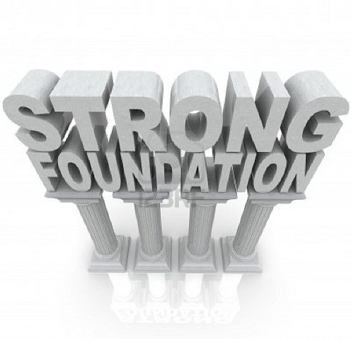
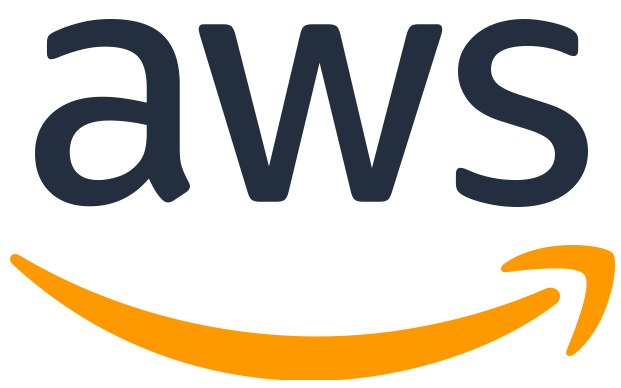

layout: false
class: center, middle, inverse

# AWS SA Work Sample

### An introduction to Matt Callaway
### November 2020

---

.left-column[
# Agenda


]

.right-column[
<br/>
<br/>
* Personal History (5min)
* Professional Backstory (10m)
* Technical Scenario, Tools and Methods (20min)
* Lessons Learned (5min)
* Where might AWS fit? (5min)
* Discussion
]

???

Good morning<br/>
It's a pleasure<br/>
A lot of opportunity for tangents<br/>
I encourage this to be "conversational"<br/>

... attempt to set proper context

... prior to technical deep dive

--
.right-column[
### Goals:
* Give a sense of who I am
* Show what I'm like as an employee, as a coworker
* Demonstrate what I've done
* Show how I work, with a technical example
]

???

An audience that must fill several roles

... like a hiring manager

... like a coworker

... like a customer

---

.left-column[
# History
About me
]

.right-column[


* 1997: BS. Math, Physics
* 1999: MS. Physics
* 2000-2008: SecurePipe Inc "startup life"


* 2008-2010: SecurePipe acquired by Trustwave
* 2010-2017: McDonnell Genome Institute
* 2017-2020: Wash U RIS


**Outside of work**

* Father of 3
* Music fan
* CrossFitter
* Bicyclist
* Motorcyclist

"Movement through nature"

"Passionate in my interests"
]

???

Grew up in KC -> Columbia MO -> Madison WI -> STL

Leaving school for tech startup in FLOSS, wasn't excited about being a prof. Astrophysics was a difficult landscape.

Kids taking over hobbies, 2003, STL.

Hobbies: Movement through nature.

Skiing, hiking, running. Ultimate frisbee, guitar.  Music. Heavy metal.

Nothing halfway:

* ultimate frisbee city runners up
* published in ApJ
* open mic nights and bands
* olympic lifting competition
* cycling race

Current Books: Free Will, Waking Up, Understanding Consciousness, The Signal and The Noise. Eternal Golden Braid, Hofstadter.

Iain Banks "Culture" novels, "Player of Games" etc. UK LeGuin, Left Hand of Darkness, Dispossessed.

Movies: ???

---

.left-column[
# History

About me

<!--

-->

]

.right-column[

### What's Matt like?

In terms of a maxim or motto...

* Curiosity, tenacity, empathy, in search of balance.
]
--
.right-column[
* Curiosity: A desire to know, to learn
* Tenacity: The determination to figure things out
* Empathy: Care about and share the feelings of others
* Seeking balance: Seeking the *correct* proportions
]
--
.right-column-up[
* "The long tail"
* "Enabler of others"
* "Give me the ball"
* Don't re-invent wheels
* Make a contribution, to the team, to humanity
]


???

* Characteristics that show up in everything I do.
* Curiosity about all things
* Being a *seeker*
* The truth matters, there *is* a reality aside from feelings
* What gets me up in the morning
* Being "smart enough" compared to...
* ... 3 standard deviations and into the long tail

---

.left-column[
# Scenario

Backstory
]

.right-column[

### Begin work at MGI in 2010

* Traditional HPC with static compute images
* Large Oracle OLAP/OLTP databases (billions of rows)
* Laboratory automation (LIMS)
* Basic automated primary and secondary analysis
* Two teams, 15-20 application developers, Perl
]


???

* SecurePipe/Trustwave was lots of data and data mining
* MGI was similarly lots of data and data mining
* The tools/tech were all very similar
* Interviewing, RDBMs tables and relations
* Someone saying, "He's one of us"

--

.right-column[
* **Systems team (~5), support and development, basic ticket tracking**
* **Manual changes, no change control, no project management, ad-hoc/reactionary**
]

???

* Systems team quite far behind development teams
* Devs were close to scientists though

---

.left-column[
# Scenario

Backstory
]

.right-column[

### Transforming "Systems" to "Systems Engineering"

* Introduce VMWare: **change velocity**
* Introduce Agile and Kanban: **project visibility**
* Convince a skeptical team

#### Build social/political capital


]

???

* Not being dogmatic
* eg. Owning your code is a requirement for Agile
* Dev *and* support, lots of investigation
* The can of Colt 45 winning the bet to get VMWare

---

.left-column[
# Scenario

Backstory


<br/>
<br/>

]

.right-column[

### Transforming to "Systems Engineering"

Close the divide between "Systems" and "Development" and "Users".

#### Communicating is the key, and better tools help

* Begin to reveal and measure "toil"
* Introduce transparency
* Introduce Git and Puppet: **configuration management**
* Introduce CI/CD
* Introduce "rollback"
* Introduce "blameless post-mortems"

]

---

.left-column[
# Scenario

Backstory


]

.right-column[

### Transforming to "Systems Engineering"

* The Phoenix Project
* Googe's SRE Book
]

???

First, Second, Third Way<br/>
Biz -> Dev -> Ops -> Customer : 1<br/>
Feedback Loops : 2<br/>
Continuous experimentation/learning : 3<br/>

SRE and DevOps<br/>
The Golden Signals<br/>
Latency, Traffic, Errors, Saturation<br/>
Lead time for changes<br/>
Deployment frequency<br/>
Time to restore service<br/>
Change failure rate<br/>
--
.right-column-up[
* Accelerate cultural shift
* Accelerate velocity
]
--
.right-column-up[
* Introduce Vagrant and OpenStack
* Introduce tracking software dependencies
* Introduce software packaging artifacts: (.deb, .rpm)

Development teams and their Users began to see a reduction in "break/fix" work.
Change begins to happen without fear. Time to deployment reduces\*.

\* Though we never arrived at measuring MTTD, MTTR, etc.
]

---
.left-column[
# Scenario

Backstory


]

.right-column[

### Transforming to "Systems Engineering"

* Introduce Docker
* Solve the "static OS image" problem
* Solve the "docker runs as root" problem
]

--
.right-column-up[
* Begin transferring "ownership" to PI Labs
* First PI labs move to AWS
* Web sites and databases (CiViC, DGIdb)
* https://civicdb.org/
* https://www.dgidb.org/
]

--
.right-column-up[
* Introduce Ansible
* Solve the "two run" problem of PuppetDB
* Improve coordinated action across many hosts
* Development environments in GCP
]

---

.left-column[
# Scenario

Backstory


]

.right-column[

### My story so far

I adopted a "first among equals" management style:

* Creating the Systems Engineering role
* *Living* DevOps as that term came into vogue
* Project Management **without dogma**
* Virtualization technologies: VMware, OpenStack
* Automation/Change: Git, Puppet, Ansible
* CI/CD with Jenkins, Bamboo
* Observability: Prometheus, Grafana
* Centralized Logging: ElasticSearch, Logstash
* Abstraction into a *Service Catalog*
* Leader in the adoption of Docker in HPC

Goal: Portable, repeatable science in Hybrid Clouds.

Establishing *ownership* by each Lab.
]

---
.left-column[
# Scenario
Backstory

]

.right-column[
### What's Matt's role?
Issue creation, *defining* work:


]
---
.left-column[
# Scenario
Backstory
]

.right-column[
### What's Matt's role?
Issue assignment, *doing* work:


]
---
.left-column[
# Scenario
Backstory

Total Lines:

- Ansible: 159,761
- Puppet3: 86,143
- Puppet4: 68,543
- Docs: 40,562
- Manual: 8,477
]
.right-column[
### What's Matt's role?
Git commits, *doing* work:


]
---
.left-column[
# Scenario
Backstory
]
.right-column[
### What's Matt's role?
Pull requests, *doing* work:


]
---
.left-column[
# Scenario
Backstory
]

.right-column[
### What's Matt's role?
Project management, *managing* work:


* Inspired by Agile
* Inclusive of Kanban for Support
* "on-call" rotation to protect Development
]

---
.left-column[
# Scenario
Backstory


]
.right-column[

### Summary, The Story So Far

### What's my role?

* See the community and best practices
* See my Org's Mission
* See the required cultural changes
]

--
.right-column-up[
* Align my team with partners
* Define and own the work
* Bring the tools
* Communicate
* Deliver solutions

### Living each day in the trenches with my team.
]

---
.left-column[
# Scenario

Problem Statement
]

.right-column[

### Let's go deeper

In 2017, Washington University in St. Louis moved the McDonnell Genome
Institute (MGI) IT Team to a central IT group, forming Research Infrastructure
Services (RIS).
]

--

.right-column[
Mandate:

**Create a University-wide Service Catalog providing "research infrastructure" to
faculty, staff, and students.**

* High performance computing
* High performance storage
* Data transfer
]
--
.right-column[
**"Very Important Professor has been recruited from Important University to be your first customer."**
]

???

The Randall Martin Lab. Promises had been made to deliver by September of 2019.
Hardware wasn't even ordered until October. A shipping container fell off a boat.
Things didn't exist until January of 2020.

---
.left-column[
# Scenario

Problem Statement
]
.right-column[
### Clarifying Requirements

* Define the stakeholders involved.
* Define the lifecycle of the data involved.
* Define the accesss rules.
* Define the network paths.
* Define storage and computing resources.
]
--
.right-column[
Are there hard numbers on these requirements?
* Network throughput/latency requirements?
* Storage throughput/latency requirements?
* Compute requirements?
]
---
.left-column[
# Scenario

Problem Statement

Clarifying Requirements
]
.right-column[
### In a better world...

The design process would have identified network throughput and latency
requirements.

**Network**

* Analyze performance: bandwidth, latency, jitter
* Analyze features: traffic shaping, congestion control
* Analyze protocols: TCP, UDP (minimal)
* Profile performance (before GA)

**Storage**

* Analyze distribution of file size
* Analyze distribution of read/write

"We have no defined use cases at this time. Buy what we can afford and
benchmark common workloads."

We didn't do this very well. I look forward to improving upon this.
]

???

This is a major frustration of mine.

Commit and ship before defining.

Just the reality of my life, not the way I wanted it.

---
.left-column[
# Scenario

Provide Compute Services

### Context


]

.right-column[

### The Stakeholders

* U Leadership: Political pressures
* U Governance: Competing priorities
* U Researchers: Needing resources
* PIs: Feeling financial strain
* RIS Team: Not yet well integrated into WUIT
]
--
.right-column[

]
---

.left-column[
# Scenario

My Team/Role
]

.right-column[
### The Team

* 1 Director
* 1 Architect
* 4 Team Leads (including me)
* User Support (2)
* Hardware Engineering (3)
* Application Engineering (6)
* Systems Engineering (6) (**my team**)


]

--
.right-column-up[
### I am not at the top of the org but I see my role as "The Communicator".
]

---
.left-column[
# Scenario

Relationships
]

.right-column[
### People First

* Wash U senior leadership
* Other Wash U Technical Teams
* Principle Investigators
* Technically Savvy Staff
* Normal Users, Vendors, Collaborators, ...more


]
--
.right-column-up[
### It is my practice to build relationships
]

???

* Nobody tells me to do this

---
.left-column[
# Scenario

Challenges
]

.right-column[

### Challenges/Risks

* Integrate Identity
* Integrate Networks
* Establish Governance
* Establish Funding/Chargeback
* Competition from other groups
* Move from Ubuntu to RHEL
* Incorporate SELinux
* Incorporate Docker
* New major versions of IBM software

#### Much of the tech is familiar, but lots of change. Also, politics.


]
---
.left-column[
# Technical Details

]
.right-column[
### Common Infrastructure Pre-requisites

These are the underpinnings of all RIS Services:

* Physical Datacenter (WUIT)
* Wired and wireless network connectivity (WUIT)
* Physical workstation or laptop (WUIT)
* Identity Management (WUIT)<br/><br/>
* Provisioning (Satellite)
* Configuration Management (Ansible)
* Scheduled Tasks (Jenkins)
* Monitoring/Alerting (Prometheus, Grafana, PagerDuty)
* Log Management (ELK, Splunk)
* Continous Integration/Delivery (Bamboo)
* Software Artifacts (Registry)
* Infiniband Networking
* Communications (Office365,JIRA,Confluence,Slack,etc.)
]

???

All built and managed by my team

---
.left-column[
# Technical Details

Network
]
.right-column[
### Datacenter Networks

The RIS hardware team built this IB fabric.


]
---
.left-column[
# Technical Details

Network
]
.right-column[
### Campus Networks

The Wash U Central Networking team built campus networks.


]
---
.left-column[
# Technical Details

Hardware
]
.right-column[
### Rack Hardware


* Dell C6420: Dual socket, 16 DIMM slots
* Dual Intel Gold 6132 16 core 2.8 Ghz processors
* 384GB of 2933Mhz memory
* PCI-e 2 x 240GB SATA M.2 SSD drives in RAID 1
]
---
.left-column[
# Technical Details

Storage
]
.right-column[
### Storage Design

IBM Spectrum Scale GPFS parallel filesystem

3 clusters: storage1, cache1, scratch1

Each has the following "roles"

* Hitachi G800 Storage Arrays
* Network Storage Device  (NSD) (3x) - Disks
* Cluster Export Services (CES) (3x) - SMB
* Data Transfer           (DTN) (2x) - Globus
* Spectrum Protect/Tivoli (HSM/TSM)  - Tape
* Filesystem Manager      (FSM) (1x) - Manager
* Policy Manager          (ILM) (1x) - Policy
* Management GUI          (GUI) (1x) - Dashboard

]
---
.left-column[
# Technical Details

Storage
]
.right-column[
### Storage Design
The "storage1" cluster is the main long term storage environment:

]
---
.left-column[
# Technical Details

Storage
]
.right-column[
### Compute/Storage Relationship
Compute includes a "cache" and "scratch" cluster, where cache
is an IBM GPFS AFM relationship to the "storage1" cluster:

]
---
.left-column[
# Technical Details

Storage
]
.right-column[
### Storage Design

Ansible Inventory Groups

```shell
@storage_gpfs_storage1:
  |--@storage_gpfs_storage1_ces:
  |  |--rdcw-5-12-ces1.ris.wustl.edu
  |  |--rdcw-5-12-ces2.ris.wustl.edu
  |  |--rdcw-5-12-ces3.ris.wustl.edu
  |--@storage_gpfs_storage1_dtn:
  |  |--rdcw-5-12-dtn1.ris.wustl.edu
  |  |--rdcw-5-12-dtn2.ris.wustl.edu
  |--@storage_gpfs_storage1_fsmgr:
  |  |--storage1-fsmgr1.ris.wustl.edu
  |--@storage_gpfs_storage1_gui:
  |  |--storage1-gui1.ris.wustl.edu
  |--@storage_gpfs_storage1_hsm:
  |  |--rdcw-5-12-hsm1.ris.wustl.edu
  |  |--rdcw-5-12-hsm2.ris.wustl.edu
  |--@storage_gpfs_storage1_ilm:
  |  |--storage1-ilm1.ris.wustl.edu
  |--@storage_gpfs_storage1_nsd:
  |  |--rdcw-5-12-nsd1.ris.wustl.edu
  |  |--rdcw-5-12-nsd2.ris.wustl.edu
  |  |--rdcw-5-12-nsd3.ris.wustl.edu
  |--@storage_gpfs_storage1_tsm:
  |  |--rdcw-5-12-tsm1.ris.wustl.edu
  |  |--rdcw-5-12-tsm2.ris.wustl.edu
```
]
---
.left-column[
# Technical Details

Storage
]
.right-column[
### Storage Design

Ansible Roles and Playbooks

```bash
- role: accounts-domain-member
- role: ahuffman.resolv
- role: ris.collectd
- role: ris.common-packages
- role: ris.logrotate
- role: ris.ntp
- role: ris.prometheus-exporters
- role: ris.register-rhn
- role: ris.rsyslog
- import_playbook: cluster_facts.yml
- import_playbook: fileset_quota.yml
- import_playbook: gpfs_callbacks.yml
- import_playbook: gpfs_ces_enable.yml
- import_playbook: gpfs_ces_server.yml
- import_playbook: gpfs_filesets.yml
- import_playbook: gpfs_gui_enable.yml
- import_playbook: gpfs_mounts.yml
- import_playbook: gpfs_servers_setup.yml
- import_playbook: gpfs_setup_afm.yml
- import_playbook: gpfs_ssh_prereqs.yml
- import_playbook: interface_options.yml
```

```bash
> git ls-files -z services/storage/ | xargs -0 wc -l
   44739 total
```
]
---
.left-column[
# Technical Details

Compute
]
.right-column[
### Compute Design
Compute services allow Users access to a job scheduler.
Execution nodes connect to scratch and cache storage.

]
---
.left-column[
# Technical Details

Compute
]
.right-column[
### Ansible Inventory Groups
```terminal
@compute_lsf_compute1:
  |--@compute_lsf_compute1_client:
  |  |--compute1-client-1.ris.wustl.edu
  |  |--compute1-client-2.ris.wustl.edu
  |  |--compute1-client-3.ris.wustl.edu
  |  |--compute1-client-4.ris.wustl.edu
  |--@compute_lsf_compute1_db:
  |  |--compute1-db-1.ris.wustl.edu
  |--@compute_lsf_compute1_exec:
  |  |--compute1-exec-1.ris.wustl.edu
  ...
  |  |--compute1-exec-280.ris.wustl.edu
  |--@compute_lsf_compute1_gui:
  |  |--compute1-gui-1.ris.wustl.edu
  |--@compute_lsf_compute1_master:
  |  |--compute1-master-1.ris.wustl.edu
  |  |--compute1-master-2.ris.wustl.edu
  |  |--compute1-master-3.ris.wustl.edu
```
]
---
.left-column[
# Technical Details

Compute
]
.right-column[
### Ansible Roles and Playbooks
```bash
- import_playbook: pre_lsf_installation.yml
- import_playbook: ibm_lsf_installer.yml
- import_playbook: post_lsf_installation.yml
- import_playbook: wustlkey_groups.yml
- import_playbook: remove_cache_entries.yml
- import_playbook: scratch_dirs.yml
- import_playbook: allocations.yml
- import_playbook: remove_cache_entries.yml
- import_playbook: compute1_master_refresh_groups.yml
```
```bash
> git ls-files -z services/compute/ | xargs -0 wc -l
  1484388 total
```

Many more lines of Ansible due to IBM's playbooks
representing the LSF installer.
]

---
.left-column[
# Technical Details

Provision "condos"
]
.right-column[
### Ansible builds a storage and compute "Allocation"

We present a notion of "condominiums" for storage and compute.

```ruby
> cat services/storage/allocations/storage1/wucci.yml
---
allocation:
    wustlkey: fitzp
    custom_name: wucci
    afm_cache_enable: true
    department_number: 3979
    issue_key: ITDEV-13526
    add_archive: true
    quota: 1024T
    dir_projects:

        Cryo-EM:
            rw:
            - lab-wucci-cryo
            - lab-wucci-fib
```
]

--
.right-column-up[
```ruby
> ./bin/ansible-playbook services/storage/allocations.yml
```
]
---
.left-column[
# Technical Details

Provision "condos"
]
.right-column[
### Ansible builds a storage and compute "Allocation"

* IBM Spectrum Scale GPFS Storage Fileset
* GPFS/NFSv4 Access Control Lists (ACLs)
* Compute via a caching layer (IBM AFM)

```terminal
# pwd
/storage1/fs1/wucci
# mmgetacl Active | grep -P '^[^#\s]'
special:owner@:rwxc:allow:DirInherit
special:owner@:rw-c:allow:FileInherit
group:ris-it-admin:rwx-:allow:DirInherit
group:ris-it-admin:rw--:allow:FileInherit
group:storage-wucci:rwx-:allow:DirInherit
group:storage-wucci:rw--:allow:FileInherit
group:storage-wucci-cryo-em-ro:r-x-:allow
group:storage-wucci-cryo-em-rw:r-x-:allow
...
```

```terminal
[mcallawa@compute1-client-1 ~]$ bqueues
QUEUE_NAME      PRIO STATUS       NJOBS  PEND   RUN  SUSP
general          10  Open:Active    668     0   668     0
general-interac  10  Open:Active      5     0     5     0
```
]
---
.left-column[
# Technical Details

SELinux Policy
]
.right-column[
### SELinux

Along with ACLs, SELinux is used to secure containers:

```terminal
> ls -1 *.te
ris-byobu.te
ris-client-storage.te
ris-container-gpu.te
ris-container-homedir.te
ris-container-storage1.te
ris-mkhomedir.te
ris-permissive-containers.te
```
```terminal
module ris-container-storage1 1.1;
require {
    type container_t;
    type default_t;
    type ssh_home_t;
    ...
    class dir { add_name create getattr ioctl lock open read remove_name rename reparent rmdir search setattr write };
    ...
    class lnk_file { append create execute getattr ioctl link lock read rename setattr unlink write };
}
allow container_t default_t:dir read;
allow container_t ssh_home_t:dir read;
allow container_t tmp_t:dir { add_name create getattr ioctl lock open read remove_name rename reparent rmdir search setattr write };
...
```
]
---
.left-column[
# Technical Details

User Experience
]
.right-column[
### What does it look like?

The SMB interfaces is as one would expect:


]
---
.left-column[
# Technical Details

User Experience
]
.right-column[
### What does it look like?

The Globus interfaces offers easy file transfer into storage:


]
---
.left-column[
# Technical Details

User Experience
]
.right-column[
### What does it look like?

With data uploaded via SMB or Globus, a standard POSIX interface:
```terminal
[mcallawa@compute1-client-1 ~]$ whoami
mcallawa
[mcallawa@compute1-client-1 ~]$ hostname
compute1-client-1.ris.wustl.edu
[mcallawa@compute1-client-1 ~]$ ls -l /scratch1/fs1/mcallawa
total 34
drwx--S---. 2 mcallawa compute-mcallawa 1024 Oct 23 15:41 data
[mcallawa@compute1-client-1 ~]$ ls -l /storage1/fs1/mcallawa
total 33
drwx------. 11 root root          8192 Oct 24 18:54 Active
drwx------.  2 root ris-it-admin  8192 Jul 23 16:19 Archive
-rw-r--r--.  1 root root          2327 Sep 17 11:30 README.txt
```
]
---
.left-column[
# Technical Details

User Experience
]
.right-column[
### Job Scheduler

The job scheduler offers a host of features:


```terminal
$ bqueues general-interactive
QUEUE_NAME      PRIO STATUS      MAX NJOBS PEND RUN SUSP
general-interac  10  Open:Active   -   154    0 154    0
```
]
---
.left-column[
# Technical Details

User Experience
]
.right-column[
### User Documentation

Documentation includes a user manual:


* All documentation is Python Sphinx in Git
* Total Lines of Code: 8477
* Authors: 11 (average 46.1 commits per author)
]
---
.left-column[
# Technical Details

User Experience
]
.right-column[
### Running programs

*"Can you show me how to run python?"*
]
--
.right-column[
```json
> ssh compute1-client-1.ris.wustl.edu

[mcallawa@compute1-client-1 ~]$
```
]

--

.right-column-up[
```json
[mcallawa@compute1-client-1 ~]$ bsub -Is -a 'docker(python)' bash
Job <12595> is submitted to default queue <general-interactive>.
<<Waiting for dispatch ...>>
<<Starting on compute1-exec-177.ris.wustl.edu>>
Using default tag: latest
latest: Pulling from library/python
16ea0e8c8879: Pull complete
... pull layers ...
Digest: sha256:cea522e86d1a42e0bf339e9b615a3d76f2258916ee16dc562ff9182ef15ece05
Status: Downloaded newer image for python:latest
docker.io/library/python:latest
I have no name!@compute1-exec-177:~$ python --version
Python 3.8.0
```
]
---
.left-column[
# Technical Details

User Experience
]
.right-column[
### Running programs

*"How about a Jupyter Notebook?"*

```terminal
LSF_DOCKER_VOLUMES="/storage1/fs1/mcallawa/Active:/storage1/fs1/mcallawa/Active" \
LSF_DOCKER_PORTS="8200:8200" \
PATH="/opt/conda/bin:$PATH \
bsub -Is \
    -G compute-ris \
    -q general-interactive \
    -a 'docker(jupyter/scipy-notebook)' \
    -R 'select[port8200=1]' \
    jupyter notebook --port 8200
```
]
---
.left-column[
# Technical Details

User Experience
]
.right-column[
### Running programs

*"How about a VNC Desktop?"*

```json
[mcallawa@compute1-client-1 ~]$ compute1-gui-desktop
...
Created password for your noVNC web login.
Your password for noVNC is: 3gGVEkrWd6I=
...
You can access your compute1 desktop with th url
https://compute1-exec-142.compute.ris.wustl.edu:8901/vnc.html?resize=remote
```


]
---
.left-column[
# Technical Details

Summary
]
.right-column[
### What have we just seen?

This has been an overview of RIS Storage and Compute

```bash
[mcallawa@compute1-client-1 ~]$ bsub -Is -a 'docker(python)' bash
Job <12595> is submitted to default queue <general-interactive>.
...
I have no name!@compute1-exec-177:~$ python --version
Python 3.8.0
```
]
--
.right-column-up[
* Wash U Faculty, Staff, Students (and Guests)
* Integrated identities and Wash U networks
* SMB and Globus data movement
* Complex access controls tied to AD groups
* Docker containers bringing *arbitrary software*
* 5,000+ CPU cores, 500,000+ GPU cores, 100G network
* 10+ PB storage, caching, scratch, backups, snapshots
* **Complete, controlled, independent, reproducible science**
* **Cloud ready**
]
---
.left-column[
# Technical Details

Summary
]
.right-column[
### Working With Customers

An excerpt of a quote from an early user:

.box[
We have piloted our approach on 20,000 individuals. In this pilot, our method
uncovered at least a dozen genetic associations with height and basal
metabolic rate that standard methods did not... We aim to scale our method
... in cohorts with over 100,000 individuals.

Acknowledgements:

We'd like to thank Matt Callaway and the rest of the RIS team for their help
in getting early compute1 access and support which has been absolutely
necessary for our progress on this project.
]
]

---
.left-column[
# Results
]
.right-column[
### Compute Service Adoption


]
---
.left-column[
# Results
]
.right-column[
### Storage Service Adoption


]
---
.left-column[
# Results
]
.right-column[
### User Satisfaction

Most users seem happy with the way things work.


]
---
.left-column[
# Results


]
.right-column[
### Positive

* "Our previous university had centralized computing resources. Doesn't everyone expect this to exist?"
* "We're already using containers, this is great. We'll be able to run here and in the cloud."
* "We used to build all our own gear, but then the computers overheated in the closet."
* "This isn't what we did at our previous university, but this is much better."
* "Granting agencies don't want us to purchase hardware anymore."
* "This is exciting!"
]
--
.right-column[
.right-column-right[
### "We don't want to think about building infrastructure. I want to think about science. Thanks for building this!"
]
]
---
.left-column[
# Results


]
.right-column[
### Negative

* "This is not what we did at our previous university."
* "I have no idea what my 'software dependencies' are."
* "But we want to own and control all of our gear."
* "The guy who built our gear left 10 years ago."
* "We're going to need a lot of help with this."
* "We don't want to share."
* "It's too complicated."
* "It's too expensive."
* "It's too hard."
]
--
.right-column[
.right-column-right[
### "Now we have to go back and re-learn how we built all this stuff!"
]
]
---
.left-column[
# Lessons

What Have I Learned?


]
.right-column[
### It's more than just this project!

* Your problem is almost certainly not unique.
* Writing original code is a last resort.
* Reject solutions that have no community.
* Culture matters more than planning.
* Incentives matter at all levels.
* Over promising is death.
* Leadership matters more than belief.
* Measure and manage team capacity.
* Connect the daily work to the mission.
* Manage expectations, communicate.
* "Architecture" is a social endeavor.
* Find the clear next step.
* Bias to action.
* Strive for loose coupling.
* Spot the decisions that are hard to change.
]
---
.left-column[
## AWS Futures


]
.right-column[
### AWS Architecture

#### Compute and Storage

* AWS VPC
* AWS S3 Integration to Spectrum Scale
* AWS S3 Integration to Globus datatransfer
* AWS EC2 HPC Compute Cluster
* AWS ECR: Image scanning, container management
* AWS EC2 and EKS
]
--
.right-column[
* We are already using GCP for ad-hoc development.
* The same thing is possible in AWS.
* Some Users already using AWS for web content.
* Growing use of Glacier for storage.
* Growing interest in cloud-bursting "batch" compute.
* Growing interest in k8s/EKS for microservices.
]
---
.left-column[
## AWS Futures


]
.right-column[
### AWS Architecture

#### Operations

* AWS Auto Scaling
* AWS CloudWatch (monitoring, SRE)
* AWS Control Tower (base environment)
* AWS Systems Manager (control infra)
* AWS CloudFormation (reproducible infra)
* AWS CloudTrail (record API calls)
* AWS Config (AWS config history)
* AWS OpsWorks (chef and puppet)
]
--
.right-column[
* Strong attraction for the RIS Team.
* Shifting away from running tools...
* Focusing on insights.
]
---
.left-column[
## AWS Futures


]
.right-column[
### AWS Architecture

#### Database

* Aurora: Migration of various PostgreSQL/MySQL DBs
* Elasticache: Redis, Memcache and relation to workflow engines
]
--
.right-column-up[
* Many users run RDBMs in relation to research tooling.
]
--
.right-column-up[
#### Analytics

* Athena/Redshift analysis of S3 storage
* Metadata is huge
* EMR: Hadoop, Spark, Flink
* Data Lakes
* Tableau
* AWS Glue: ETL
]
--
.right-column-up[
* Growing pressure to build data lakes
* Relating hostpital EMR and research
]
.right-column-up[
### This is all the stuff we *want* to be doing!
]
---
.left-column[
## AWS Futures


]
.right-column[
### AWS Architecture

#### Cost Controls, Management, Governance

* AWS Trusted Advisor
* AWS License Manager
]
--
.right-column-up[
* Growing pressure for license management.
* Growing pressure to adhere to best practices.
]
--
.right-column-up[
#### Security, Identity, Compliance

* HIPAA, PHI, EMR
]
--
.right-column-up[
### Bridging the gap between "research" and "clinical".
]

]
---
.left-column[
# Q & A
]
.right-column[

### Discussion


*Even high performance machines sometimes get stuck in the mud.*

# Thank you!
]

<!--
background-image: url(./images/agile.png)
background-position: right 200px bottom 10px
-->
