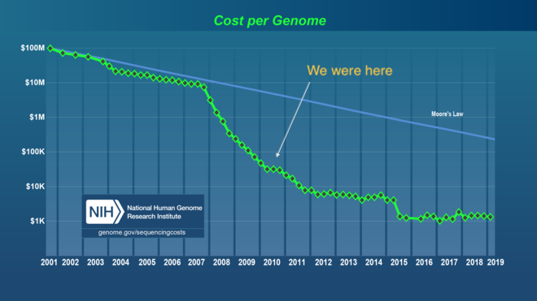
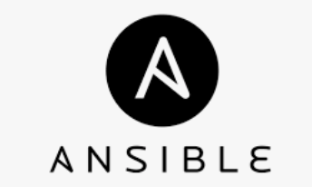
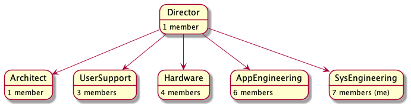

layout: false
class: center, middle, inverse

# AWS SA Work Sample

### An introduction to Matt Callaway
### November 2020

---

.left-column[
# Agenda


]

.right-column[
* #### Personal History (5min)
* #### Professional Backstory (10m)
* #### Technical Scenario, Tools and Methods (20min)
* #### Lessons Learned (5min)
* #### What could have been done with AWS (5min)
* #### Discussion
]

???

I have a lot to cover

... attempt to set proper context

... prior to technical deep dive

--
.right-column[
### Goals:
* Show a sense of who I am
* Show what I'm like as an employee, as a coworker
* Show what I've done both technical and non-technical
* Show how I work
* Show a technical example
]

???

An audience that must fill several roles

... like a hiring manager

... like a coworker

... like a customer

---

.left-column[
# History
About me
]

.right-column[


* 1997: BS. Math, Physics
* 1999: MS. Physics
* 2000-2008: SecurePipe Inc "startup life"


* 2008-2010: SecurePipe acquired by Trustwave
* 2010-2017: McDonnell Genome Institute
* 2017-2020: Wash U RIS


**Outside of work**

* Father of 3
* Linux enthusiast
* CrossFitter
* Bicyclist
* Motorcyclist

"Movement through nature"

"Passionate in my interests"
]

???

Grew up in KC

Columbia MO, Madison WI

Leaving school for tech

Kids taking over hobbies

Skiing, hiking, boats.
Ultimate frisbee, guitar.
Music. Heavy metal.

Movement through nature.

---

.left-column[
# History

About me

<!--

-->

]

.right-column[

### What's Matt like?

In terms of a maxim or motto...

* Curiosity, tenacity, empathy, in search of balance.
]
--
.right-column[
* Curiosity: Want to know
* Tenacity: Figure it out
* Empathy: Care about affects on others
* Seeking balance (always elusive)
]
--
.right-column[
* "The long tail"
* "Enabler of others"
* "Give me the ball"
* Don't re-invent wheels
* Make a contribution, to the team, to humanity
]


???

* Characteristics that show up in everything I do.
* Curiosity about all things
* The truth matters, there *is* a reality aside from feelings
* What gets me up in the morning
* Being "smart enough" compared to...
* ... 3 standard deviations and into the long tail

---

.left-column[
# Scenario

Backstory
]

.right-column[

### Begin work at MGI in 2010

* Traditional HPC with static compute images
* Large Oracle OLAP/OLTP databases (billions of rows)
* Laboratory automation (LIMS)
* Basic automated primary and secondary analysis
* Two teams, 15-20 application developers, Perl
]



???

* SecurePipe/Trustwave was lots of data and data mining
* MGI was similarly lots of data and data mining
* The tools/tech were all very similar
* Interviewing, RDBMs tables and relations
* Someone saying, "He's one of us"

--

.right-column[
* **Systems team (~5), support and development, basic ticket tracking**
* **Manual changes, no change control, no project management, ad-hoc/reactionary**
]

???

* Systems team quite far behind development teams
* Devs were close to scientists though

---

.left-column[
# Scenario

Backstory
]

.right-column[

### Transforming "Systems" to "Systems Engineering"

* Introduce VMWare: **change velocity**
* Introduce Agile and Kanban: **project visibility**
* Convince a skeptical team

#### Build social/political capital


]

???

* Not being dogmatic
* Owning your code is a requirement for Agile
* Dev *and* support, lots of investigation

---

.left-column[
# Scenario

Backstory


<br/>
<br/>

]

.right-column[

### Transforming to "Systems Engineering"

Close the devide between "Systems" and "Development" and "Users".

#### Communicating is the key, and better tools help

* Begin to reveal and measure "toil"
* Introduce transparency
* Introduce Git and Puppet: **configuration management**
* Introduce CI/CD
* Introduce "rollback"
* Introduce "blameless post-mortems"

]

---

.left-column[
# Scenario

Backstory


]

.right-column[

### Transforming to "Systems Engineering"

* The Phoenix Project
* Googe's SRE Book
]
--
.right-column[
* Accelerate cultural shift
* Accelerate velocity
]
--
.right-column[
* Introduce Vagrant and OpenStack
* Introduce tracking software dependencies
* Introduce software packaging artifacts: (.deb, .rpm)

Development teams and their Users began to see a reduction in "break/fix" work.
Change begins to happen without fear. Time to deployment reduces\*.

\* Though we failed to measure MTTR, MTTR, etc

]

---
.left-column[
# Scenario

Backstory



]

.right-column[

### Transforming to "Systems Engineering"

* Introduce Docker
* Solve the "static OS image" problem
* Solve the "docker runs as root" problem
]

--
.right-column[
* Begin transferring "ownership" to PI Labs
* First PI labs move to AWS
* Web sites and databaes (CiViC, DGIdb)
* https://civicdb.org/
* https://www.dgidb.org/
]

--
.right-column[
* Introduce Ansible
* Solve the "two run" problem of PuppetDB
* Improve coordinated action across many hosts
* Development environments in GCP
]

---

.left-column[
# Scenario

Backstory
]

.right-column[

### My story so far

I took a "first among equals" leadership role:

* Creating the Systems Engineering role
* *Living* DevOps as that term came into vogue
* Project Management **without dogma**
* Virtualization technologies: VMware, OpenStack
* CI/CD with Jenkins, Bamboo
* Automation/Change: Git, Puppet, Ansible
* Observability: Prometheus, Grafana
* Centralized Logging: ElasticSearch, Logstash
* Abstraction into a *Service Catalog*
* Leader in the adoption of Docker in HPC

Portable, repeatable science in Hybrid Clouds.

Establishing *ownership* with each Lab.
]

---
.left-column[
# Scenario
Backstory
]

.right-column[
### What's Matt's role?
Issue creation, *defining* the work

]
---
.left-column[
# Scenario
Backstory
]

.right-column[
### What's Matt's role?
Issue assignment, *doing* the work

]
---
.left-column[
# Scenario
Backstory
]

.right-column[
### What's Matt's role?
Git commits, *doing* the work

]
---
.left-column[
# Scenario
Backstory
]

.right-column[
### What's Matt's role?
Git commits, *doing* the work

]
---
.left-column[
# Scenario
Backstory
]

.right-column[
### What's Matt's role?
Project management, sprints, *doing* the work


* Inspired by Agile
* Inclusive of Kanban for Support
* "on-call" rotation to protect Development
]

---
.left-column[
# Scenario
Backstory


]
.right-column[

# Summary

### What's my role?

* See the community and best practices
* See my Org's Mission
* See the required cultural changes
]

--
.right-column[
* Align my team with partners
* Define and own the work
* Bring the tools
* Communicate
* Deliver solutions

### Living each day in the trenches with my team.
]

---
.left-column[
# Scenario

Problem Statement
]

.right-column[

### Let's go deeper

In 2017, Washington University in St. Louis moved the McDonnell Genome
Institute (MGI) IT Team to a central IT group, forming Research Infrastructure
Services (RIS).
]

--

.right-column[
Mandate:

**Create a University-wide Service Catalog providing "research infrastructure" to
faculty, staff, and students.**

* High performance computing
* High performance storage
* Data transfer
]

--

.right-column[
#### Let us focus on the RIS Compute Service.
]

---
.left-column[
# Scenario

Provide Compute Services

### Context


]

.right-column[

### The Stakeholders

* U Leadership: Political pressures
* U Governance: Struggling for unity
* U Researchers: Needing computational resources
* PIs: Feeling financial strain
* RIS Team: Not yet well integrated into WUIT
]
--
.right-column[

]
---

.left-column[
# Scenario

My Team/Role
]

.right-column[
### The Team

* 1 Director
* 1 Architect
* 4 Team Leads (including me)
* User Support (2)
* Hardware Engineering (3)
* Application Engineering (6)
* Systems Engineering (6) (**my team**)


]

--
.right-column[
* #### I am not at the top of the org
* #### ...but my role is "The Communicator"
]

---
.left-column[
# Scenario

Relationships
]

.right-column[
### People First

* Wash U senior leadership
* Other Wash U Technical Teams
* Principle Investigators
* Technically Savvy Staff
* Normal Users, Vendors, Collaborators, ...more


]
--
.right-column[
### It is my practice to build relationships
]

???

* Nobody tells me to do this

---
.left-column[
# Scenario

Challenges
]

.right-column[

### Challenges/Risks

* Integrate Identity
* Integrate Networks
* Establish Governance
* Establish Funding/Chargeback
* Choose and order hardware
* Establish RedHat Site License
* Move from Ubuntu to RHEL
* Incorporate SELinux
* Incorporate Docker

#### Much of the tech is familiar territory, but it's a lot of changes all at once.


]

---
.left-column[
# Technical Details
## Network
]
.right-column[
### Network Topology
Datacenter Networks

]
---
.left-column[
# Technical Details
## Network
]
.right-column[
### Network Topology
Campus Networks

]
---
.left-column[
# Technical Details
## Hardware
]
.right-column[
### Rack Hardware


* Dell C6420: Dual socket, 16 DIMM slots
* Dual Intel Gold 6132 16 core 2.8 Ghz processors
* 384GB of 2933Mhz memory
* PCI-e 2 x 240GB SATA M.2 SSD drives in RAID 1
]
---
.left-column[
# Technical Details
]
.right-column[
### Common Infrastructure Pre-requisites

Things that exist before we begin:

* Physical datacenter
* Physical and wireless network connectivity
* Redundant uplinks through ISPs
* Physical workstation or laptop
* An active University Identity (WUSTL Key)
]

--
.right-column[
### The Challenge

* #### Move data into storage
* #### Compute on that data
* #### Share that data
]

---
.left-column[
# Technical Details
]
.right-column[
### Storage Design

IBM Spectrum Scale GPFS parallel filesystem

3 clusters: storage1, cache1, scratch1

Each has the following "roles"

* Hitachi G800 Storage Arrays
* Network Storage Device  (NSD) (3x) - Disks
* Cluster Export Services (CES) (3x) - SMB
* Data Transfer           (DTN) (2x) - Globus
* Spectrum Protect/Tivoli (HSM/TSM)  - Tape
* Filesystem Manager      (FSM) (1x) - Manager
* Policy Manager          (ILM) (1x) - Policy
* Management GUI          (GUI) (1x) - Dashboard

]
---
.left-column[
# Technical Details
]
.right-column[
### Storage Design
The "storage1" cluster is the main long term storage environment:

]
---
.left-column[
# Technical Details
]
.right-column[
### Compute/Storage Relationship
Compute includes a "cache" and "scratch" cluster, where cache
is an IBM GPFS AFM relationship to the "storage1" cluster:

]
---
.left-column[
# Technical Details
]
.right-column[
### Storage Design

Ansible Inventory Groups

```shell
@storage_gpfs_storage1:
  |--@storage_gpfs_storage1_ces:
  |  |--rdcw-5-12-ces1.ris.wustl.edu
  |  |--rdcw-5-12-ces2.ris.wustl.edu
  |  |--rdcw-5-12-ces3.ris.wustl.edu
  |--@storage_gpfs_storage1_dtn:
  |  |--rdcw-5-12-dtn1.ris.wustl.edu
  |  |--rdcw-5-12-dtn2.ris.wustl.edu
  |--@storage_gpfs_storage1_fsmgr:
  |  |--storage1-fsmgr1.ris.wustl.edu
  |--@storage_gpfs_storage1_gui:
  |  |--storage1-gui1.ris.wustl.edu
  |--@storage_gpfs_storage1_hsm:
  |  |--rdcw-5-12-hsm1.ris.wustl.edu
  |  |--rdcw-5-12-hsm2.ris.wustl.edu
  |--@storage_gpfs_storage1_ilm:
  |  |--storage1-ilm1.ris.wustl.edu
  |--@storage_gpfs_storage1_nsd:
  |  |--rdcw-5-12-nsd1.ris.wustl.edu
  |  |--rdcw-5-12-nsd2.ris.wustl.edu
  |  |--rdcw-5-12-nsd3.ris.wustl.edu
  |--@storage_gpfs_storage1_tsm:
  |  |--rdcw-5-12-tsm1.ris.wustl.edu
  |  |--rdcw-5-12-tsm2.ris.wustl.edu
```
]

---
.left-column[
# Technical Details
]
.right-column[
### Storage Design

Ansible Roles and Playbooks

```bash
- role: accounts-domain-member
- role: ahuffman.resolv
- role: ris.collectd
- role: ris.common-packages
- role: ris.logrotate
- role: ris.ntp
- role: ris.prometheus-exporters
- role: ris.register-rhn
- role: ris.rsyslog
- import_playbook: cluster_facts.yml
- import_playbook: fileset_quota.yml
- import_playbook: gpfs_callbacks.yml
- import_playbook: gpfs_ces_enable.yml
- import_playbook: gpfs_ces_server.yml
- import_playbook: gpfs_filesets.yml
- import_playbook: gpfs_gui_enable.yml
- import_playbook: gpfs_mounts.yml
- import_playbook: gpfs_servers_setup.yml
- import_playbook: gpfs_setup_afm.yml
- import_playbook: gpfs_ssh_prereqs.yml
- import_playbook: interface_options.yml
```

```bash
> git ls-files -z services/storage/ | xargs -0 wc -l
   44739 total
```
]

---
.left-column[
# Technical Details
]
.right-column[
### Compute Design
Compute services allow Users access to a job scheduler.
Execution nodes connect to scratch and cache storage.

]
---
.left-column[
# Technical Details
## Compute
]
.right-column[
Ansible Inventory Groups
```terminal
@compute_lsf_compute1:
  |--@compute_lsf_compute1_client:
  |  |--compute1-client-1.ris.wustl.edu
  |  |--compute1-client-2.ris.wustl.edu
  |  |--compute1-client-3.ris.wustl.edu
  |  |--compute1-client-4.ris.wustl.edu
  |--@compute_lsf_compute1_db:
  |  |--compute1-db-1.ris.wustl.edu
  |--@compute_lsf_compute1_exec:
  |  |--compute1-exec-1.ris.wustl.edu
  ...
  |  |--compute1-exec-280.ris.wustl.edu
  |--@compute_lsf_compute1_gui:
  |  |--compute1-gui-1.ris.wustl.edu
  |--@compute_lsf_compute1_master:
  |  |--compute1-master-1.ris.wustl.edu
  |  |--compute1-master-2.ris.wustl.edu
  |  |--compute1-master-3.ris.wustl.edu
```
]
---

.left-column[
# Technical Details
## Compute
]
.right-column[
Ansible Roles and Playbooks
```bash
- import_playbook: pre_lsf_installation.yml
- import_playbook: ibm_lsf_installer.yml
- import_playbook: post_lsf_installation.yml
- import_playbook: wustlkey_groups.yml
- import_playbook: remove_cache_entries.yml
- import_playbook: scratch_dirs.yml
- import_playbook: allocations.yml
- import_playbook: remove_cache_entries.yml
- import_playbook: compute1_master_refresh_groups.yml
```
```bash
> git ls-files -z services/compute/ | xargs -0 wc -l
  1484388 total
```

Many more lines of Ansible due to IBM's playbooks
representing the LSF installer.
]

---
.left-column[
# Technical Details
## Provision "condos"
]
.right-column[
### Ansible builds a storage and compute "Allocation"

We present a notion of "condominiums" for storage and compute.

```ruby
> cat services/storage/allocations/storage1/wucci.yml
---
allocation:
    wustlkey: fitzp
    custom_name: wucci
    afm_cache_enable: true
    department_number: 3979
    issue_key: ITDEV-13526
    add_archive: true
    quota: 1024T
    dir_projects:

        Cryo-EM:
            rw:
            - lab-wucci-cryo
            - lab-wucci-fib
```
]

--
.right-column[
```ruby
> ./bin/ansible-playbook services/storage/allocations.yml
```
]

---
.left-column[
# Technical Details
## Provision Storage "condo"
]
.right-column[
### Ansible builds a storage and compute "Allocation"

* IBM Spectrum Scale GPFS Storage Fileset
* GPFS/NFSv4 Access Control Lists (ACLs)
* Compute via a caching layer (IBM AFM)

```terminal
# pwd
/storage1/fs1/wucci
# mmgetacl Active | grep -P '^[^#\s]'
special:owner@:rwxc:allow:DirInherit
special:owner@:rw-c:allow:FileInherit
group:ris-it-admin:rwx-:allow:DirInherit
group:ris-it-admin:rw--:allow:FileInherit
group:storage-wucci:rwx-:allow:DirInherit
group:storage-wucci:rw--:allow:FileInherit
group:storage-wucci-cryo-em-ro:r-x-:allow
group:storage-wucci-cryo-em-rw:r-x-:allow
...
```

```terminal
[mcallawa@compute1-client-1 ~]$ bqueues
QUEUE_NAME      PRIO STATUS       NJOBS  PEND   RUN  SUSP
general          10  Open:Active    668     0   668     0
general-interac  10  Open:Active      5     0     5     0
```
]
---
.left-column[
# Technical Details
## SELinux Policy
]
.right-column[
## SELinux

Along with ACLs, SELinux is used to secure containers:

```terminal
> ls -1 *.te
ris-byobu.te
ris-client-storage.te
ris-container-gpu.te
ris-container-homedir.te
ris-container-storage1.te
ris-mkhomedir.te
ris-permissive-containers.te
```
```terminal
module ris-container-storage1 1.1;
require {
    type container_t;
    type default_t;
    type ssh_home_t;
    ...
    class dir { add_name create getattr ioctl lock open read remove_name rename reparent rmdir search setattr write };
    ...
    class lnk_file { append create execute getattr ioctl link lock read rename setattr unlink write };
}
allow container_t default_t:dir read;
allow container_t ssh_home_t:dir read;
allow container_t tmp_t:dir { add_name create getattr ioctl lock open read remove_name rename reparent rmdir search setattr write };
...
```
]
---
.left-column[
# Technical Details
## Compute and Storage
]
.right-column[
## What does it look like?

The SMB interfaces is as one would expect:


]
---
.left-column[
# Technical Details
## Compute and Storage
]
.right-column[
## What does it look like?

The Globus interfaces offers easy file transfer into storage:


]
---
.left-column[
# Technical Details
## Compute and Storage
]
.right-column[
## What does it look like?

With data uploaded via SMB or Globus, a standard POSIX interface:
```terminal
[mcallawa@compute1-client-1 ~]$ whoami
mcallawa
[mcallawa@compute1-client-1 ~]$ hostname
compute1-client-1.ris.wustl.edu
[mcallawa@compute1-client-1 ~]$ ls -l /scratch1/fs1/mcallawa
total 34
drwx--S---. 2 mcallawa compute-mcallawa 1024 Oct 23 15:41 data
[mcallawa@compute1-client-1 ~]$ ls -l /storage1/fs1/mcallawa
total 33
drwx------. 11 root root          8192 Oct 24 18:54 Active
drwx------.  2 root ris-it-admin  8192 Jul 23 16:19 Archive
-rw-r--r--.  1 root root          2327 Sep 17 11:30 README.txt
```
]
---
.left-column[
# Technical Details
## Compute and Storage
]
.right-column[
### Job Scheduler

The job scheduler offers a host of features:


```terminal
$ bqueues general-interactive
QUEUE_NAME      PRIO STATUS      MAX NJOBS PEND RUN SUSP
general-interac  10  Open:Active   -   154    0 154    0
```
]
---
.left-column[
# Technical Details
## Compute and Storage
]
.right-column[
### User Documentation

Documentation includes a user manual:


* Total Lines of Code: 8477
* Authors: 11 (average 46.1 commits per author)

]

---
.left-column[
# Technical Details
## Compute and Storage
]
.right-column[
## Running programs

*"Can you show me how to run python?"*
]
--
.right-column[
```terminal
> ssh compute1-client-1.ris.wustl.edu

[mcallawa@compute1-client-1 ~]$
```
]

--

.right-column[
```terminal
[mcallawa@compute1-client-1 ~]$ bsub -Is -a 'docker(python)' bash
Job <12595> is submitted to default queue <general-interactive>.
<<Waiting for dispatch ...>>
<<Starting on compute1-exec-177.ris.wustl.edu>>
Using default tag: latest
latest: Pulling from library/python
16ea0e8c8879: Pull complete
... pull layers ...
Digest: sha256:cea522e86d1a42e0bf339e9b615a3d76f2258916ee16dc562ff9182ef15ece05
Status: Downloaded newer image for python:latest
docker.io/library/python:latest
I have no name!@compute1-exec-177:~$ python --version
Python 3.8.0
```
]

---
.left-column[
# Technical Details
## Compute and Storage
]
.right-column[
## Running programs

*"How about a Jupyter Notebook?"*

```terminal
LSF_DOCKER_VOLUMES="/storage1/fs1/mcallawa/Active:/storage1/fs1/mcallawa/Active" \
LSF_DOCKER_PORTS="8200:8200" \
PATH="/opt/conda/bin:$PATH \
bsub -Is \
    -G compute-ris \
    -q general-interactive \
    -a 'docker(jupyter/scipy-notebook)' \
    -R 'select[port8200=1]' \
    jupyter notebook --port 8200
```
]
---
.left-column[
# Technical Details
## Compute and Storage
]
.right-column[
## Running programs

*"How about a VNC Desktop?"*

```terminal
[mcallawa@compute1-client-1 ~]$ compute1-gui-desktop
...
Created password for your noVNC web login.
Your password for noVNC is: 3gGVEkrWd6I=
...
You can access your compute1 desktop with th url
https://compute1-exec-142.compute.ris.wustl.edu:8901/vnc.html?resize=remote
```


]
---
.left-column[
# Technical Details
## Summary
]
.right-column[
## What have we just seen?

This has been an overview of RIS Storage and Compute

```terminal
[mcallawa@compute1-client-1 ~]$ bsub -Is -a 'docker(python)' bash
Job <12595> is submitted to default queue <general-interactive>.
...
I have no name!@compute1-exec-177:~$ python --version
Python 3.8.0
```
]

--
.right-column[
* Wash U Faculty, Staff, Students (and Guests)
* Integrated Wash U core networks
* SMB and Globus data movement
* Complex access controls tied to AD groups
* Docker containers bringing *arbitrary software*
* 5,000+ CPU cores, 500,000+ GPU cores, 100G network
* 10+ PB storage, caching, scratch, backups, snapshots
* **Complete, controlled, independent, reproducible science**
* **Cloud ready**
]

---

.left-column[
# Results
]

.right-column[
### Compute Service Adoption


]

---

.left-column[
# Results
]

.right-column[
### Storage Service Adoption


]
---

.left-column[
# Results
]

.right-column[

### User Satisfaction

Most users seem happy with the way things work.


]

---
.left-column[
# Results


]

.right-column[

### Positive

* "We're already using containers, this is great. We'll be able to run here and in the cloud."
* "This isn't what we did at our previous university, but this is much better."
* "We used to build all our own gear, but then the computers overheated in the closet."
* "Granting agencies don't want us to purchase hardware anymore."
* "We used to build all our own stuff, but then the guy who ran it quit."
* "Our previous university had centralized computing resources. Doesn't everyone expect this to exist?"
* "This is exciting!"
]
--
.right-column[
* ### "We don't want to think about building infrastructure. I want to think about science. Thanks for building this!"
]

---
.left-column[
# Results


]

.right-column[

### Negative

* "This is too hard."
* "This is not what we did at our previous university."
* "We're going to need a lot of help with this."
* "But we want to own and control all of our gear."
* "I have no idea what my 'software dependencies' are."
* "We don't want to share."
* "It's too complicated."
* "It's too expensive."
]
--
.right-column[
* ### "Now we'll have to go back and re-learn how we built all this stuff!"
]

---

.left-column[
# Lessons

What Have I Learned?

]
.right-column[
### More than just this project

* Leadership matters more than belief.
* Culture matters more than planning.
* Incentives matter.
* Over promising is death.
* Measure and manage team capacity.
* Connect the daily work to the mission.
* Manage expectations, communicate.
* "Architecture" is a social endeavor.
* Find the clear next step.
* Strive for loose coupling.
* Spot the decisions that are hard to change.
* Bias to action.
]


---

.left-column[
## AWS Futures
]
.right-column[
## AWS Architecture

### Compute and Storage

* AWS VPC
* AWS S3 Integration to Spectrum Scale
* AWS S3 Integration to Globus datatransfer
* AWS EC2 HPC Compute Cluster
* AWS ECR: Image scanning, container management
* AWS EC2 and EKS
]

---
.left-column[
## AWS Futures
]
.right-column[
## AWS Architecture

### Operations

* AWS Auto Scaling
* AWS CloudWatch (monitoring, SRE)
* AWS Control Tower (base environment)
* AWS Systems Manager (control infra)
* AWS CloudFormation (reproducible infra)
* AWS CloudTrail (record API calls)
* AWS Config (AWS config history)
* AWS OpsWorks (chef and puppet)
]

---
.left-column[
## AWS Futures
]
.right-column[
## AWS Architecture

### Database

* Aurora: Migration of various PostgreSQL/MySQL DBs
* Elasticache: Redis, Memcache and relation to workflow engines

### Analytics

* Athena/Redshift analysis of S3 storage: Metadata is huge
* EMR: Hadoop, Spark, Flink
* Data Lakes
* Tableau
* AWS Glue: ETL
]

---
.left-column[
## AWS Futures
]
.right-column[
## AWS Architecture

### Cost Controls, Management, Governance

* AWS Trusted Advisor
* AWS License Manager

### Security, Identity, Compliance

* HIPAA, PHI, EMR
]

---

.left-column[
# Q & A
]
.right-column[

## Discussion


*"Even advanced technology sometimes gets stuck in the mud."*

# Thank you!
]

---

<!--
background-image: url(./images/agile.png)
background-position: right 200px bottom 10px
-->

---

*Is it easy?*

--

### Nothing's ever easy. But it's possible! And that's worth a lot!

---

# It's not so easy

### What software does your team depend on?

--

### Know the software dependencies/requirements.

--

### Do containers already exist?

--

### Build them from scratch and/or modify existing containers.

--

Reactions to this set of expectations vary depending upon personal experiences.

--
* "Of course I need to know what software my lab depends on."

vs.

* "This stuff was written 20 years ago, and all the authors have moved on."
* "What's a container?"

---

# Again, what have I shown you?

Computing is a big subject, and it's hard.

--

* I've asked you to learn your applications, what they do, how to build and use them.

--

HERE CUT
You figure that part out, and we'll do the rest...


* Identity
* Storage
* Network
* Scheduling
* Runtime
* Security
* Monitoring/Logs/Alerting
* Disaster recovery
* Regulatory compliance
* Integration of the above
* Sharing and collaboration
* Federating to the Cloud

---

# Questions

### ...Some that I've collected beforehand...

---

# Questions


### Notable Integrations

* Wustl Key Identity (single sign-on, etc.)
* Storage (storage1)
* SMB mounts to your Macbook etc.
* Globus for data transfers
* Other institutions
* Google, cloud vendors

---
### Coming soon

* Integrated Kubernetes and LSF
* Hosted/Private Docker container registry
* Automated security scans of "blessed" container images
* A growing repository of already-built tools
* Documentation/Examples of complex workflows using Toil, WDL/Cromwell, etc.
